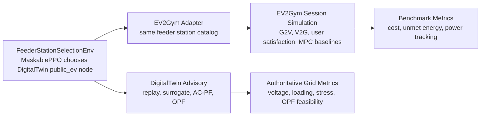
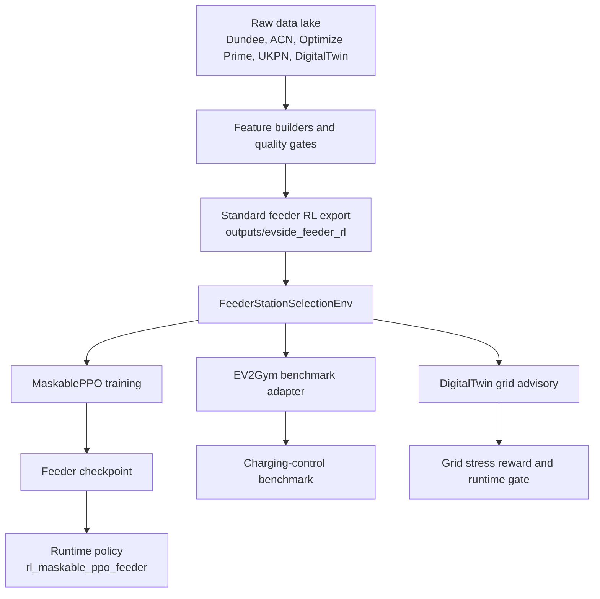

# EV-Side Data Lake, EV2Gym Feasibility, And Gym Environment Decision

Date: 2026-06-04

## Bottom Line

EV2Gym is not a better replacement for the core EV-side station-assignment environment. It is a better second-stage simulator for charging-session control, V2G/G2V experiments, MPC baselines, and benchmarking after the EV-side agent has already chosen a DigitalTwin feeder public-EV node.

The best V1 environment for this project is:

1. `FeederStationSelectionEnv` as the main RL environment.
2. Gymnasium API with a discrete action space.
3. `sb3-contrib` MaskablePPO for invalid-action masking.
4. DigitalTwin feeder public-EV nodes as the action catalog.
5. Dundee, ACN, Optimize Prime, and other EV session datasets as request/session behavior priors only.
6. DigitalTwin advisory replay/surrogate/AC-PF/OPF as the grid truth.
7. EV2Gym as a downstream simulator and benchmark, not as the grid oracle.

This means the EV-side and grid-side projects work in the same geography and at the same electrical level: the UKPN DigitalTwin low-voltage feeder.

## What We Are Actually Optimizing

The EV-side RL agent is not predicting a station load forecast. It is learning a decision policy:

```text
Given:
  one customer charging request
  one feeder area
  all valid public-EV nodes/stations in that feeder
  user-service features
  rich DigitalTwin grid-impact metrics

Choose:
  one DigitalTwin public-EV node/station

Maximize:
  customer service quality
  while avoiding grid stress, voltage problems, loading problems, OPF infeasibility,
  curtailment, and uncertainty
```

The current V1 action is therefore:

```text
action = choose one public_ev station/node from the same DigitalTwin secondary_area_id
```

That is why MaskablePPO fits: many actions are invalid for a request because they are outside the feeder area or not compatible.

## Current Evidence From The Workspace

### Implemented feeder RL package

The EV-side project now contains:

```text
packages/ev_core/src/ev_core/rl_feeder/
  contracts.py
  repository.py
  requests.py
  scenarios.py
  observations.py
  rewards.py
  env.py
```

This package uses DigitalTwin feeder actions, not Dundee stations.

### Generated feeder export

Current generated smoke package:

```text
A:/coding/Projects/USSEE/Implementations/DigitalTwin.2.0/outputs/evside_feeder_rl/
  manifest.json
  model_card.json
  feeder_ev_action_catalog.parquet
  feeder_request_priors.parquet
  feeder_grid_advisory_replay.parquet
  feeder_episode_catalog.parquet
  ev2gym_config/
```

Current smoke export counts:

| Artifact | Current Count | Meaning |
| --- | ---: | --- |
| `feeder_ev_action_catalog.parquet` | 50 rows | DigitalTwin public-EV feeder actions, capped smoke export |
| `secondary_area_id` count | 8 areas | Feeder areas represented in smoke export |
| `feeder_request_priors.parquet` | 24 rows | Dundee/ACN/DigitalTwin-style behavior priors |
| `feeder_grid_advisory_replay.parquet` | 50 rows | Rich advisory replay rows, currently deterministic mock bootstrap |
| EV2Gym native chargers | 50 chargers | One EV2Gym charger per feeder action |
| EV2Gym native transformers | 8 transformers | One EV2Gym transformer grouping per secondary area |

Important: the current export was intentionally capped with `--max-actions 50`. A production export should remove that cap after the source quality issues below are resolved.

## EV2Gym Feasibility Study

### What EV2Gym is good at

The local EV2Gym repo is a complete smart-charging simulator:

```text
A:/coding/Projects/USSEE/Implementations/DigitalTwin.2.0/EV-side/EV2Gym-main/EV2Gym-main
```

It includes:

| Capability | Evidence |
| --- | --- |
| Gymnasium environment | `ev2gym/models/ev2gym_env.py` defines `class EV2Gym(gym.Env)` |
| Continuous charging actions | `action_space = spaces.Box(...)` over all charging ports |
| Session simulation | EV arrival, departure, desired capacity, current capacity, charger ports |
| V2G/G2V behavior | `v2g_enabled`, charge/discharge current limits |
| MPC and heuristic baselines | `ev2gym/baselines/` |
| Reward functions | `ev2gym/rl_agent/reward.py` |
| State functions | `ev2gym/rl_agent/state.py` |
| Replay/evaluation output | replay and statistics paths in `ev2gym_env.py` |
| Optional grid simulation | `simulate_grid`, `pf_solver`, network data templates |

EV2Gym is very useful when the question is:

```text
For chargers that already exist, how much should each connected EV charge or discharge at each timestep?
```

That is a continuous-control problem.

### What EV2Gym is not ideal for

EV2Gym is not naturally the correct main environment for the current station-selection goal because its action is:

```text
action = vector of charge/discharge power commands per charging port
```

Our main EV-side problem is:

```text
action = choose one public-EV station/node for one customer request
```

Those are different decision levels.

### Critical local EV2Gym limitation

The local EV2Gym loader has this constraint in `ev2gym/utilities/loaders.py`:

```text
assert env.charging_network_topology is None, "Charging network topology is not supported with grid simulation."
```

So in this local copy:

```text
custom DigitalTwin topology + EV2Gym internal simulate_grid=True
```

is not supported.

That is a major reason DigitalTwin must remain the authoritative grid truth. EV2Gym can benchmark charging-session control, but its internal grid simulation should not replace DigitalTwin voltage/loading/PF/OPF outputs.

### EV2Gym dependency issue found

No-training import smoke check:

| Environment | Result |
| --- | --- |
| EV-side venv | Fails because `pandapower` is missing |
| DigitalTwin venv | Fails because `gymnasium` is missing |

EV2Gym imports `pandapower` even when `simulate_grid: false`, because `ev2gym/models/grid.py` is imported during loader import. Before EV2Gym can be run locally, use one environment with at least:

```text
gymnasium
pyyaml
pandas
numpy
networkx
pandapower
matplotlib
multicopula
```

`gurobipy` is required for some optimizer baselines, but not necessarily for every simple EV2Gym simulation.

## EV2Gym Integration Decision

Use EV2Gym in three controlled ways:



Do not use EV2Gym as:

```text
the main station-selection environment
the source of UKPN feeder truth
the final voltage/loading oracle
```

Use EV2Gym as:

```text
a benchmark simulator
a second-stage scheduling/control environment
a way to compare heuristic, MPC, PPO, SAC, TD3 style charging-control policies
a later bridge toward hierarchical RL or MARL
```

## Data Lake Redistribution Plan

### Principle

Raw data can live in many places, but EV-side training should consume one standardized contract package:

```text
outputs/evside_feeder_rl/
```

The EV-side project should not directly guess from raw UKPN, raw Dundee, raw ACN, or raw Optimize Prime files during training. Instead:

```text
Raw data lake -> DigitalTwin/EV-side feature builders -> standardized feeder RL export -> Gym environment
```

### Data ownership by role

| Role | Source Of Truth | Use In EV-Side RL | Should Define Actions? |
| --- | --- | --- | --- |
| Feeder geography | DigitalTwin Phase 3.9 UKPN feeder artifacts | `secondary_area_id`, `node_id`, electrical topology | Yes |
| Public-EV action catalog | DigitalTwin `public_ev` demand points mapped to electrical nodes | `feeder_ev_action_catalog` | Yes |
| Grid stress metrics | DigitalTwin advisory replay/surrogate/PF/OPF | reward features and runtime gates | No, metrics only |
| Customer request timing | Dundee sessions, ACN sessions, EV-side processed replays | arrival priors, duration, slack | No |
| Energy requested | Dundee, ACN, EV session datasets | requested kWh, target SoC priors | No |
| Charger behavior | Dundee chargepoints, ACN station sessions, EV2Gym EV specs | charger preference, session simulator calibration | No |
| UKPN smart meter/load | UKPN usage data, DigitalTwin profiles | base load/stress context | No |
| UK-wide EV station POIs | UKPN/other station lists | optional POI enrichment after feeder mapping | Only after mapping to DigitalTwin nodes |
| SimBench | grid benchmark/reference | test-only or method comparison | No |
| Optimize Prime | fleet/depot charging | future depot/fleet request priors | No for public station selector |
| EV2Gym bundled data | ElaadNL-style distributions, prices, network templates | benchmark fallback only | No |

## Data Quality Findings

This is a targeted model-readiness audit, not a full forensic audit of every raw file.

### DigitalTwin public-EV source

Source:

```text
data/digital_twin_outputs/v3/topology/phase3_9/snapshot=phase39_pylovo_v3_topology_ready_020/corrected_public_ev_assignment.parquet
```

Observed:

| Metric | Value |
| --- | ---: |
| Rows | 919 |
| Areas | 13 |
| `demand_type = public_ev` | 919 |
| `secondary_area_id` null | 0% |
| `demand_point_id` null | 0% |
| `p_base_kw` null | 0% |
| `public_ev_capacity_kw` null | 100% |
| `truth_status` | synthetic brownfield-like feeder grouping |

Model-readiness score for final action catalog: 62/100.

Why: it has excellent action identity coverage, but public charger capacity is missing and electrical node linking needs validation. It is usable for smoke tests and early training, not yet for final thesis claims without documenting assumptions.

### DigitalTwin electrical nodes

Source:

```text
data/digital_twin_outputs/v3/topology/phase3_9/snapshot=phase39_pylovo_v3_topology_ready_020/electrical_nodes.parquet
```

Observed:

| Metric | Value |
| --- | ---: |
| Rows | 240 |
| Areas | 20 |
| `secondary_area_id` null | 0% |
| `truth_status` | mostly representative synthetic LV nodes |
| Direct linked demand IDs | mostly absent |

Model-readiness score for feeder topology crosswalk: 70/100.

Why: it is enough for area-level feeder-aligned smoke training. For final physical precision, we need a validated public-EV-to-node crosswalk rather than nearest-node assignment.

### Current generated feeder action catalog

Source:

```text
outputs/evside_feeder_rl/feeder_ev_action_catalog.parquet
```

Observed:

| Metric | Value |
| --- | ---: |
| Rows | 50 |
| Areas | 8 |
| Unique station IDs | 50 |
| `station_id` null | 0% |
| `secondary_area_id` null | 0% |
| `demand_point_id` null | 0% |
| `node_id` null | 0% |
| `charger_kw` null | 0% |
| `truth_status` | `feeder_aligned` |

Model-readiness score for smoke training: 78/100.

Why: schema is strong and training scripts work, but the export is capped and the charger/node assumptions still need stronger validation.

### Dundee EV-side data

Sources include:

```text
EV-side/.../data/interim/dundee_sessions_model_ready.parquet
EV-side/.../data/processed/request_replay_2023.csv
EV-side/.../data/processed/request_replay_2024.csv
EV-side/.../data/processed/station_master.csv
EV-side/.../data/processed/chargepoint_master.csv
```

Observed:

| Dataset | Rows | Stations | Notes |
| --- | ---: | ---: | --- |
| `dundee_sessions_model_ready.parquet` | 377,070 | 35 | 0% `station_id` null, 0% `energy_kwh` null |
| `dundee_sessions_clean.parquet` | 387,843 | 35 | 0.79% `energy_kwh` null |
| `request_replay_2024.csv` | 90,320 | 35 | good behavior replay |
| `request_replay_2023.csv` | 117,701 | 31 | good behavior replay |
| `station_master.csv` | 35 | 35 | real Dundee station catalog, wrong geography for UKPN feeder training |

Model-readiness score for request behavior priors: 86/100.

Why: Dundee is excellent for public charging behavior priors, but it must not define the EV-side action space when the grid side is UKPN DigitalTwin.

### ACN data

Source:

```text
A:/coding/Projects/USSEE/Implementations/grid-ev-advisory/data/4- ACN-Data-Static-main/session data/
```

Observed:

| File | Sessions |
| --- | ---: |
| `Caltech_sessions.json` | 13,199 |
| `JPL_sessions.json` | 12,699 |
| `Office1_sessions.json` | 1,683 |

Useful fields:

```text
connectionTime
disconnectTime
doneChargingTime
kWhDelivered
siteID
stationID
spaceID
userInputs
timezone
```

Model-readiness score for request/session priors: 82/100.

Why: ACN has strong real session behavior, especially workplace-like charging, but it is not UKPN geography and not the station action source.

### UKPN data lake

Source:

```text
A:/coding/Projects/USSEE/Implementations/grid-ev-advisory/data/3- UKPN/
```

Sample observed files:

```text
Network usage/ukpn-smart-meter-consumption-lv-feeder.parquet
Network usage/ukpn-secondary-site-utilisation.parquet
Network infrastructure/ukpn-low-carbon-technologies-secondary.parquet
Network infrastructure/UK-EV_Charging_stations.csv
```

Observed:

| Dataset | Rows | Key Finding |
| --- | ---: | --- |
| `ukpn-smart-meter-consumption-lv-feeder.parquet` | 30,000 | consumption fields around 17.89% null |
| `ukpn-secondary-site-utilisation.parquet` | 116,883 | utilisation band present, reinforcement year 100% null |
| `ukpn-low-carbon-technologies-secondary.parquet` | 25,499 | secondary LCT context, low nulls on core fields |
| `UK-EV_Charging_stations.csv` | 23,494 | station POIs, but ratings mostly null and needs feeder/node mapping |

Model-readiness score for grid context priors: 72/100.

Why: valuable for load and stress context, but identifiers must be harmonized into DigitalTwin `secondary_area_id` and `node_id` before EV-side training uses them.

## Required Standard Package

The EV-side should train only from a standardized package:

```text
outputs/evside_feeder_rl/
  manifest.json
  model_card.json
  feeder_ev_action_catalog.parquet
  feeder_request_priors.parquet
  feeder_grid_advisory_replay.parquet
  feeder_episode_catalog.parquet
  ev2gym_config/
    feeder_ev2gym.yaml
    charging_topology_ev2gym.json
    charging_topology_manifest.json
    README.md
```

### Required contracts

`feeder_ev_action_catalog.parquet` must define:

```text
station_id
secondary_area_id
demand_point_id
node_id
p_base_kw
public_ev_capacity_kw
charger_kw
connector_type
x/y or latitude/longitude
truth_status
source_system
```

`feeder_request_priors.parquet` must define:

```text
secondary_area_id
source
requested_energy_kwh
battery_kwh
current_soc
target_soc
slack_minutes
charger_type_preference
max_ac_kw
max_dc_kw
```

`feeder_grid_advisory_replay.parquet` must define rich grid metrics:

```text
stress_score
baseline_v_min_pu
post_v_min_pu
delta_v_min_pu
baseline_max_line_loading_percent
post_max_line_loading_percent
delta_max_line_loading_percent
baseline_max_trafo_loading_percent
post_max_trafo_loading_percent
delta_max_trafo_loading_percent
voltage_violation_count
line_overload_count
trafo_overload_count
bottleneck_element_id
bottleneck_element_type
bottleneck_margin_percent
max_allowed_kw
curtailment_required_kw
feasible_energy_kwh
opf_feasible
opf_objective_value
opf_curtailment_kwh
opf_cost_delta
losses_kw
delta_losses_kw
voltage_sensitivity_pu_per_kw
loading_sensitivity_percent_per_kw
ood_flag
uq_flag
confidence_score
evaluation_mode_used
```

## Best Environment Architecture

### Stage 1: Station assignment

Use:

```text
FeederStationSelectionEnv + MaskablePPO
```

Reason:

| Requirement | Fit |
| --- | --- |
| Choose one station/node | Discrete action space |
| Same feeder only | action mask |
| Different valid actions per request | MaskablePPO |
| Needs DigitalTwin grid metrics | observation + reward features |
| Needs local API later | grid advisory client already supports disabled/recorded/http |
| Needs manual training command | train script already supports dry-run and full run |

### Stage 2: Charging control

Use:

```text
EV2Gym
```

after the station is chosen.

Reason:

| Requirement | Fit |
| --- | --- |
| Charge/discharge power per port | EV2Gym continuous `Box` action space |
| V2G/G2V experiments | Native EV2Gym capability |
| MPC/heuristic baselines | Native EV2Gym baselines |
| Session replay and evaluation | Native EV2Gym replay/stats |
| DigitalTwin station traceability | `charging_topology_manifest.json` |

### Stage 3: Grid validation

Use:

```text
DigitalTwin advisory replay/surrogate/AC-PF/OPF
```

Reason:

| Requirement | Fit |
| --- | --- |
| UKPN feeder truth | DigitalTwin |
| voltage/loading metrics | DigitalTwin |
| OPF feasibility and curtailment | DigitalTwin |
| station/node electrical identity | DigitalTwin |
| runtime gate for severe violations | DigitalTwin advisory |

## Training Pipeline



## Recommended Next Implementation Steps

### P0: Make the action catalog production-grade

1. Remove the 50-action cap only after validation.
2. Replace default `charger_kw = 22` with actual capacity from:
   - UK EV charging station POIs if reliably matched,
   - Dundee/ACN charger priors only as statistical defaults,
   - or a documented capacity imputation table.
3. Replace nearest-node assignment with a validated crosswalk:
   - `demand_point_id -> electrical_node_id`,
   - distance-to-node,
   - confidence score,
   - review flags.
4. Add manifest quality gates:
   - no missing `station_id`, `secondary_area_id`, `demand_point_id`, `node_id`,
   - no Dundee/ACN station IDs in action catalog,
   - capacity source recorded per action,
   - node assignment method recorded per action.

### P1: Turn request priors into real composite priors

1. Parse ACN sessions into normalized rows:
   - arrival timestamp,
   - departure timestamp,
   - done charging timestamp,
   - kWh delivered,
   - site type,
   - session duration,
   - slack.
2. Merge Dundee behavior priors:
   - public charging timing,
   - energy,
   - session duration,
   - charger preference.
3. Add Optimize Prime only as a fleet/depot scenario family, not public-station default.
4. Add source weights:
   - public charging: Dundee high weight,
   - workplace: ACN high weight,
   - depot/fleet: Optimize Prime high weight.

### P2: Replace mock grid replay with DigitalTwin PF/OPF replay

1. For each feeder action and representative timestamp, run DigitalTwin PF.
2. Add candidate EV load schedule.
3. Run post-load PF and OPF/proxy OPF.
4. Export rich metrics to `feeder_grid_advisory_replay.parquet`.
5. Train using replay/surrogate, not live PF per step.

### P3: Make EV2Gym runnable and benchmarkable

1. Create one environment with all EV2Gym dependencies:
   - `gymnasium`,
   - `pandapower`,
   - `pyyaml`,
   - `networkx`,
   - `matplotlib`,
   - `multicopula`.
2. Keep `simulate_grid: false` for DigitalTwin topology configs.
3. Run one EV2Gym episode from `outputs/evside_feeder_rl/ev2gym_config/feeder_ev2gym.yaml`.
4. Compare:
   - charge-as-fast-as-possible,
   - EV2Gym MPC baseline,
   - random control,
   - station-selector + simple charging baseline.

## Direct Answer: Is EV2Gym Better?

No, not for the main EV-side station-assignment model.

Yes, for the second-stage charging-control and benchmarking model.

The correct architecture is hierarchical:

```text
MaskablePPO feeder station selector
  chooses DigitalTwin public_ev node

EV2Gym or MPC scheduler
  simulates charge/discharge control after assignment

DigitalTwin advisory/PF/OPF
  provides authoritative grid stress and feasibility
```

## References

Local evidence:

- `EV-side/EV2Gym-main/EV2Gym-main/README.md`
- `EV-side/EV2Gym-main/EV2Gym-main/ev2gym/models/ev2gym_env.py`
- `EV-side/EV2Gym-main/EV2Gym-main/ev2gym/utilities/loaders.py`
- `EV-side/EV2Gym-main/EV2Gym-main/ev2gym/rl_agent/reward.py`
- `EV-side/EV2Gym-main/EV2Gym-main/ev2gym/rl_agent/state.py`
- `outputs/evside_feeder_rl/manifest.json`
- `outputs/evside_feeder_rl/model_card.json`

External primary sources:

- EV2Gym GitHub: https://github.com/StavrosOrf/EV2Gym
- EV2Gym paper: https://arxiv.org/abs/2404.01849
- Gymnasium custom environment documentation: https://gymnasium.farama.org/v1.0.0/introduction/create_custom_env/
- Gymnasium spaces documentation: https://gymnasium.farama.org/v1.1.0/api/spaces/
- SB3-Contrib MaskablePPO documentation: https://sb3-contrib.readthedocs.io/en/master/modules/ppo_mask.html
- ACN-Data official dataset page: https://ev.caltech.edu/dataset.html
