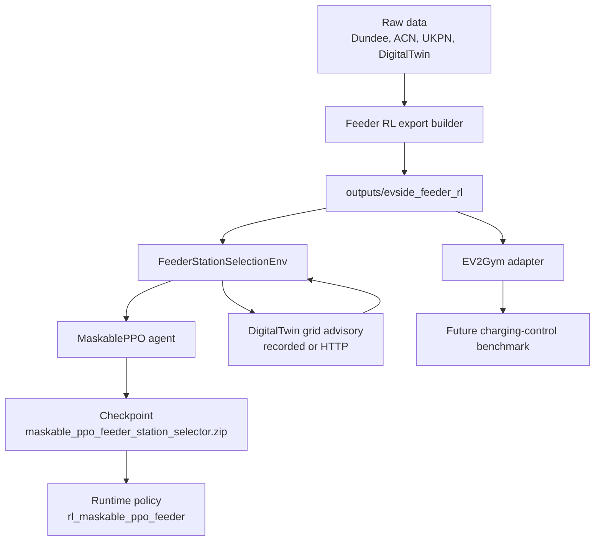
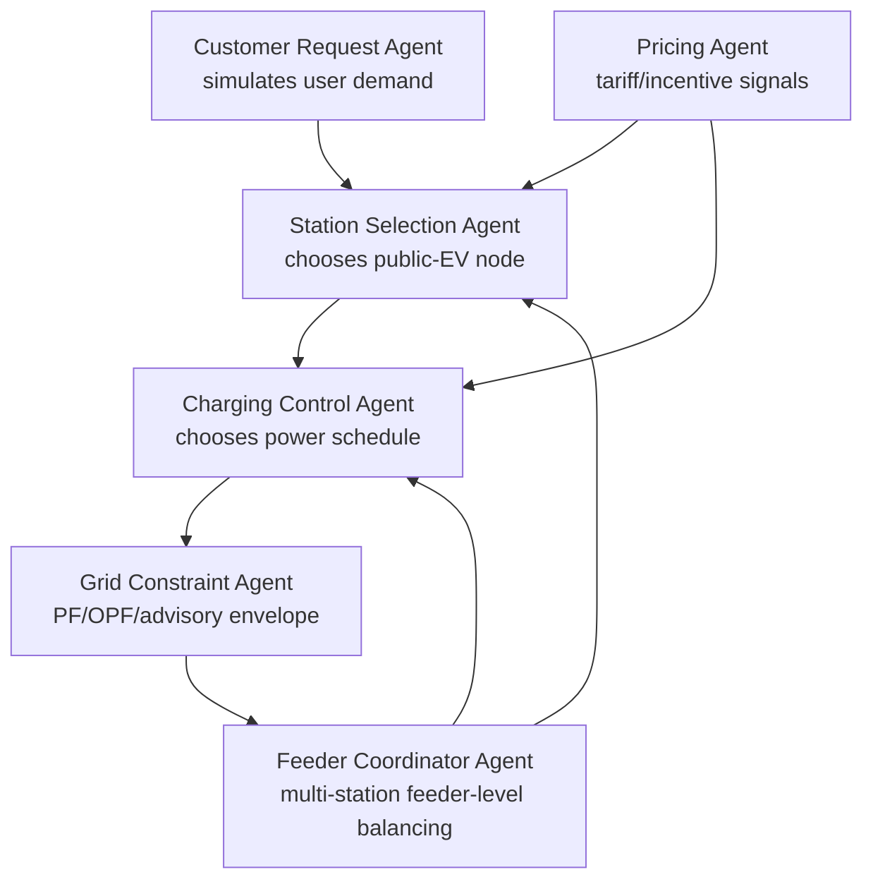

# EV-Side Feeder RL Training And Scaling Walkthrough

Date: 2026-06-04

## Completion Pass Update

The feeder RL package now has a clearer contract between smoke data and full training data.

New or updated artifacts:

```text
outputs/evside_feeder_rl/
  manifest.json
  model_card.json
  quality_report.json
  feature_stats.json
  feeder_ev_action_catalog.parquet
  feeder_request_priors.parquet
  feeder_grid_advisory_replay.parquet
  feeder_episode_catalog.parquet
  ev2gym_config/
```

Important meanings:

| Artifact | Meaning |
| --- | --- |
| `manifest.json` | Declares export mode, source paths, row counts, and whether this is smoke or full feeder data |
| `quality_report.json` | Validates action count, mapping confidence, missing nodes, duplicate station IDs, capacity status, and replay mode counts |
| `feature_stats.json` | Provides numeric scales used to keep RL observations stable |
| `feeder_ev_action_catalog` | The RL action space: DigitalTwin public-EV feeder nodes only |
| `feeder_request_priors` | Simulated request behavior priors from Dundee, ACN, and DigitalTwin context |
| `feeder_grid_advisory_replay` | Candidate grid-impact rows consumed during offline training |

The advisory API also now exposes explicit modes:

```text
replay      lookup from exported replay rows
mock        deterministic smoke/demo response
ac_pf       PF/label adapter mode
opf         OPF/label adapter mode
hybrid      replay first, PF/OPF adapter fallback
surrogate   surrogate/label adapter mode
```

If real PF/OPF label tables are not configured, `ac_pf`, `opf`, `hybrid`, and `surrogate` return a clearly labeled adapter proxy with reason code:

```text
pf_opf_label_table_not_configured_or_no_match
not_full_solver_execution
```

That means the backend route is wired, but you should only claim real PF/OPF truth after generating or connecting the real DigitalTwin PF/OPF label tables.

## Short Answer First

### Can we claim the EV-side data now follows the feeder-aligned plan?

Partly, yes.

You can claim:

> The EV-side RL training path has been reframed to use DigitalTwin low-voltage feeder public-EV nodes as the station/action space. Dundee and ACN are no longer allowed to define the station actions; they are used only as request/session behavior priors. DigitalTwin remains the grid-truth source.

You should not yet claim:

> The full production dataset and full PF/OPF advisory pipeline are complete.

Why not yet:

- The current feeder export is a smoke package capped at 50 actions.
- The current `feeder_grid_advisory_replay` uses deterministic bootstrap/mock metrics, not real generated PF/OPF replay yet.
- ACN and Dundee are represented as simplified priors in the current export, not a fully rebuilt composite request-prior dataset from all raw files.
- EV2Gym adapter files are generated, but EV2Gym itself still needs dependency setup before one-episode benchmark runs.

So the honest claim is:

> V1 is architecturally aligned and training-ready for smoke/small training. The final thesis-grade data layer still needs full-scale export, validated node/capacity mapping, and real DigitalTwin PF/OPF replay generation.

## Requirement Status Against The Plan

| Plan Requirement | Status | Evidence / Note |
| --- | --- | --- |
| Replace Dundee station action space with DigitalTwin public-EV feeder nodes | Done for V1 | `feeder_ev_action_catalog.parquet` uses `dt_public_ev:{secondary_area_id}:{demand_point_id}` station IDs |
| Dundee station catalog must not define action space | Done for V1 | Manifest says Dundee is `request-prior-only` |
| Standard export package under `outputs/evside_feeder_rl/` | Done | Manifest, action catalog, request priors, grid replay, episode catalog, EV2Gym config exist |
| Rich advisory response contract | Done | Contracts include stress, deltas, OPF, bottleneck, confidence, violations |
| Real AC-PF/OPF advisory modes | Partial | Backend now routes `ac_pf`/`opf`/`hybrid` through a PF/OPF label/proxy adapter; connect real solver label tables before claiming full PF/OPF truth |
| New feeder environment instead of mutating Dundee env | Done | `FeederStationSelectionEnv` exists |
| Request simulation from Dundee + ACN + DigitalTwin | Partial | Current export uses clearer composite prior schema; full raw ACN/Dundee parser/mixture is still next work |
| EV2Gym config export | Done | `ev2gym_config/feeder_ev2gym.yaml`, `charging_topology_ev2gym.json`, mapping manifest |
| EV2Gym smoke simulation | Partial | Adapter validation runner exists; full EV2Gym episode depends on local EV2Gym import/API binding |
| Feeder training and evaluation entrypoints | Done | `train_maskable_ppo_feeder_station_selector.py`, `evaluate_maskable_ppo_feeder_station_selector.py` |
| Train script dry-run prints required fields | Done | Verified dry-run prints area count, action count, grid metric columns, observation shape, valid action count |
| Separate runtime policy `rl_maskable_ppo_feeder` | Done, safe fallback | Registered policy exists; full runtime API integration can be expanded later |
| No full model training during setup | Done | Only dry-runs/tests were executed |

## What The Whole System Does



The system has three different jobs:

| Job | Component | Meaning |
| --- | --- | --- |
| Create possible station actions | DigitalTwin feeder export | Only DigitalTwin public-EV nodes are valid actions |
| Create customer requests | Feeder request generator | Simulates arrival time, energy, SoC, charger preference, slack |
| Choose where to send the customer | MaskablePPO station selector | Picks one valid public-EV node/station |

The RL model does not predict future load directly. It learns a decision rule:

```text
observation -> station choice
```

The observation contains:

- request features,
- feeder area,
- all candidate station/node features,
- action mask,
- grid impact features from DigitalTwin advisory.

The reward encourages:

- serving the request,
- choosing compatible capacity,
- low grid stress,
- small voltage drop,
- small line/transformer loading increase,
- no violations,
- OPF feasibility,
- low curtailment,
- low uncertainty.

## Current Data Package

Current package:

```text
A:/coding/Projects/USSEE/Implementations/DigitalTwin.2.0/outputs/evside_feeder_rl/
```

Current manifest says:

| Field | Current Value |
| --- | --- |
| action source | DigitalTwin public-EV low-voltage feeder nodes |
| rows in action catalog | 50 |
| feeder areas | 8 |
| request priors | 24 |
| grid advisory replay rows | 50 |
| Dundee role | request-prior-only |
| ACN role | request-prior-only |
| DigitalTwin role | action-catalog-and-grid-truth |

Important: this is a smoke export. For serious training, regenerate without the `--max-actions 50` cap after validating node and charger-capacity mappings.

## Main Files To Know

### DigitalTwin-side files

| File | Role |
| --- | --- |
| `scripts/export_feeder_rl_dataset.py` | Builds `outputs/evside_feeder_rl/` |
| `scripts/export_ev2gym_from_feeder_rl_dataset.py` | Builds EV2Gym config from the same feeder catalog |
| `scripts/serve_grid_advisory_api.py` | Runs local DigitalTwin advisory API |
| `src/grid_advisory/contracts.py` | Rich advisory API contract |
| `src/grid_advisory/service.py` | Replay/mock advisory backend |

### EV-side files

| File | Role |
| --- | --- |
| `packages/ev_core/src/ev_core/rl_feeder/contracts.py` | Feeder action/request/scenario dataclasses |
| `packages/ev_core/src/ev_core/rl_feeder/repository.py` | Loads feeder export package |
| `packages/ev_core/src/ev_core/rl_feeder/requests.py` | Generates customer requests |
| `packages/ev_core/src/ev_core/rl_feeder/observations.py` | Builds model observation vector |
| `packages/ev_core/src/ev_core/rl_feeder/rewards.py` | Computes reward |
| `packages/ev_core/src/ev_core/rl_feeder/env.py` | Gymnasium environment |
| `scripts/rl_training/train_maskable_ppo_feeder_station_selector.py` | Training entrypoint |
| `scripts/rl_training/evaluate_maskable_ppo_feeder_station_selector.py` | Evaluation entrypoint |
| `packages/ev_core/src/ev_core/recommender/feeder_rl_policy.py` | Runtime policy hook |

## Step 1: Activate The Correct Environment

Use the EV-side virtual environment for RL training:

```powershell
cd A:\coding\Projects\USSEE\Implementations\DigitalTwin.2.0\EV-side\ev-smart-charging-MARL\ev-smart-charging-MARL
.\.venv\Scripts\Activate.ps1
```

Check the RL dependencies:

```powershell
python -c "import gymnasium, stable_baselines3, sb3_contrib, torch; print('torch', torch.__version__, 'cuda', torch.cuda.is_available())"
```

## Export Commands

### Smoke Export

Use this for quick tests:

```powershell
cd A:\coding\Projects\USSEE\Implementations\DigitalTwin.2.0
python scripts\export_feeder_rl_dataset.py `
  --demand-points-path data\digital_twin_outputs\v3\topology\phase3_9\snapshot=phase39_pylovo_v3_topology_ready_020\corrected_public_ev_assignment.parquet `
  --nodes-path data\digital_twin_outputs\v3\topology\phase3_9\snapshot=phase39_pylovo_v3_topology_ready_020\electrical_nodes.parquet `
  --output-dir outputs\evside_feeder_rl `
  --max-actions 50 `
  --grid-evaluation-mode mock
```

### Full Export

Use this after validating mappings:

```powershell
cd A:\coding\Projects\USSEE\Implementations\DigitalTwin.2.0
python scripts\export_feeder_rl_dataset.py `
  --demand-points-path data\digital_twin_outputs\v3\topology\phase3_9\snapshot=phase39_pylovo_v3_topology_ready_020\corrected_public_ev_assignment.parquet `
  --nodes-path data\digital_twin_outputs\v3\topology\phase3_9\snapshot=phase39_pylovo_v3_topology_ready_020\electrical_nodes.parquet `
  --output-dir outputs\evside_feeder_rl `
  --max-actions none `
  --all-areas `
  --grid-evaluation-mode mock
```

Use `--secondary-area-id <area>` for one feeder. The export writes `quality_report.json`; check it before training.

When PF/OPF/surrogate label tables are available, point the exporter at them:

```powershell
python scripts\export_feeder_rl_dataset.py `
  --demand-points-path data\digital_twin_outputs\v3\topology\phase3_9\snapshot=phase39_pylovo_v3_topology_ready_020\corrected_public_ev_assignment.parquet `
  --nodes-path data\digital_twin_outputs\v3\topology\phase3_9\snapshot=phase39_pylovo_v3_topology_ready_020\electrical_nodes.parquet `
  --output-dir outputs\evside_feeder_rl `
  --max-actions none `
  --all-areas `
  --grid-evaluation-mode opf `
  --engine-label-dir path\to\pf_opf_label_tables
```

If the label directory contains a matching `feeder_pf_opf_candidate_labels`, `pf_opf_candidate_labels`, `feeder_grid_advisory_replay`, or `opf_proxy_control_labels` table, those labels are used. If no match exists, the row is labeled as an adapter proxy and is not full PF/OPF truth.

## Advisory API Commands

Start the local DigitalTwin advisory API:

```powershell
cd A:\coding\Projects\USSEE\Implementations\DigitalTwin.2.0
python scripts\serve_grid_advisory_api.py `
  --host 127.0.0.1 `
  --port 8091 `
  --replay-dir outputs\evside_feeder_rl `
  --engine-label-dir outputs\evside_feeder_rl
```

Meaning:

| Argument | Meaning |
| --- | --- |
| `--replay-dir` | Where replay rows are loaded from |
| `--engine-label-dir` | Where PF/OPF/surrogate label tables are searched for |
| `evaluation_mode=replay` | Use recorded rows |
| `evaluation_mode=ac_pf` | Use PF label table if available, otherwise labeled adapter proxy |
| `evaluation_mode=opf` | Use OPF label table if available, otherwise labeled adapter proxy |
| `evaluation_mode=hybrid` | Replay first; adapter fallback |

## Training Commands

Dry run:

```powershell
cd A:\coding\Projects\USSEE\Implementations\DigitalTwin.2.0\EV-side\ev-smart-charging-MARL\ev-smart-charging-MARL
python scripts\rl_training\train_maskable_ppo_feeder_station_selector.py `
  --feeder-rl-data-dir A:\coding\Projects\USSEE\Implementations\DigitalTwin.2.0\outputs\evside_feeder_rl `
  --grid-advisory-mode recorded `
  --grid-evaluation-mode replay `
  --scenario-count 4 `
  --dry-run
```

Actual training:

```powershell
python scripts\rl_training\train_maskable_ppo_feeder_station_selector.py `
  --feeder-rl-data-dir A:\coding\Projects\USSEE\Implementations\DigitalTwin.2.0\outputs\evside_feeder_rl `
  --output-dir models\rl_feeder `
  --tensorboard-log outputs\rl_feeder\tensorboard `
  --grid-advisory-mode recorded `
  --grid-evaluation-mode replay `
  --total-timesteps 100000 `
  --scenario-count 32
```

Watch progress:

```powershell
tensorboard --logdir outputs\rl_feeder\tensorboard
```

Evaluate without a checkpoint:

```powershell
python scripts\rl_training\evaluate_maskable_ppo_feeder_station_selector.py `
  --feeder-rl-data-dir A:\coding\Projects\USSEE\Implementations\DigitalTwin.2.0\outputs\evside_feeder_rl `
  --policy weighted `
  --grid-advisory-mode recorded `
  --grid-evaluation-mode replay `
  --output-json outputs\rl_feeder\evaluation_weighted.json `
  --output-csv outputs\rl_feeder\evaluation_runs.csv
```

Evaluate a trained checkpoint:

```powershell
python scripts\rl_training\evaluate_maskable_ppo_feeder_station_selector.py `
  --feeder-rl-data-dir A:\coding\Projects\USSEE\Implementations\DigitalTwin.2.0\outputs\evside_feeder_rl `
  --policy checkpoint `
  --checkpoint-path models\rl_feeder\maskable_ppo_feeder_station_selector.zip `
  --grid-advisory-mode recorded `
  --grid-evaluation-mode replay
```

## EV2Gym Benchmark Adapter

Generate EV2Gym files:

```powershell
cd A:\coding\Projects\USSEE\Implementations\DigitalTwin.2.0
python scripts\export_ev2gym_from_feeder_rl_dataset.py `
  --feeder-rl-data-dir outputs\evside_feeder_rl
```

Validate the adapter:

```powershell
python scripts\run_ev2gym_feeder_benchmark.py `
  --feeder-rl-data-dir outputs\evside_feeder_rl
```

This writes:

```text
outputs/evside_feeder_rl/ev2gym_config/ev2gym_benchmark_report.json
```

If EV2Gym is not importable, the report says `dependency_missing`. That is not a DigitalTwin/RL failure; it means the EV2Gym Python package needs to be installed or its local API needs to be bound.

If this says `cuda False`, training will still run on CPU, but CUDA is not being used by this venv.

## Step 2: Rebuild The Feeder RL Dataset

Run this from the DigitalTwin root:

```powershell
cd A:\coding\Projects\USSEE\Implementations\DigitalTwin.2.0
.\.venv\Scripts\python.exe scripts\export_feeder_rl_dataset.py `
  --demand-points-path data\digital_twin_outputs\v3\topology\phase3_9\snapshot=phase39_pylovo_v3_topology_ready_020\corrected_public_ev_assignment.parquet `
  --nodes-path data\digital_twin_outputs\v3\topology\phase3_9\snapshot=phase39_pylovo_v3_topology_ready_020\electrical_nodes.parquet `
  --output-dir outputs\evside_feeder_rl `
  --max-actions 50 `
  --max-replay-rows 50
```

What each argument means:

| Argument | Meaning |
| --- | --- |
| `--demand-points-path` | DigitalTwin public-EV demand-point source |
| `--nodes-path` | DigitalTwin electrical nodes used to assign each public-EV point to a node |
| `--output-dir` | Standard package consumed by EV-side RL |
| `--max-actions 50` | Smoke-test cap; remove for larger dataset |
| `--max-replay-rows 50` | Smoke-test advisory replay cap; remove for larger replay |

For production-sized export, remove:

```powershell
--max-actions 50 --max-replay-rows 50
```

but only after validating capacity and node mapping quality.

## Step 3: Rebuild The EV2Gym Adapter

Run this from the DigitalTwin root:

```powershell
cd A:\coding\Projects\USSEE\Implementations\DigitalTwin.2.0
.\.venv\Scripts\python.exe scripts\export_ev2gym_from_feeder_rl_dataset.py `
  --feeder-rl-data-dir outputs\evside_feeder_rl
```

This creates:

```text
outputs/evside_feeder_rl/ev2gym_config/
  feeder_ev2gym.yaml
  charging_topology_ev2gym.json
  charging_topology_manifest.json
  README.md
```

Use EV2Gym later for benchmark/session simulation. Do not treat EV2Gym grid results as final DigitalTwin grid truth.

## Step 4: Run Training Dry-Run

Run this from the EV-side project root:

```powershell
cd A:\coding\Projects\USSEE\Implementations\DigitalTwin.2.0\EV-side\ev-smart-charging-MARL\ev-smart-charging-MARL
.\.venv\Scripts\python.exe scripts\rl_training\train_maskable_ppo_feeder_station_selector.py `
  --feeder-rl-data-dir A:\coding\Projects\USSEE\Implementations\DigitalTwin.2.0\outputs\evside_feeder_rl `
  --grid-advisory-mode recorded `
  --grid-evaluation-mode replay `
  --scenario-count 2 `
  --dry-run
```

The verified dry-run prints:

```text
area_count: 8
public_ev_action_count: 50
request_prior_sources: dundee,acn,digitaltwin
grid_metric_columns: stress_score, post_v_min_pu, delta_v_min_pu, ...
observation_shape: (1360,)
valid_action_count: 2
ev2gym_config_available: True
dry_run: no training performed
```

If dry-run fails, do not start real training yet.

## Step 5: Start Real Training Manually

Only after dry-run passes, remove `--dry-run`:

```powershell
cd A:\coding\Projects\USSEE\Implementations\DigitalTwin.2.0\EV-side\ev-smart-charging-MARL\ev-smart-charging-MARL
.\.venv\Scripts\python.exe scripts\rl_training\train_maskable_ppo_feeder_station_selector.py `
  --feeder-rl-data-dir A:\coding\Projects\USSEE\Implementations\DigitalTwin.2.0\outputs\evside_feeder_rl `
  --output-dir models\rl_feeder `
  --tensorboard-log outputs\rl_feeder\tensorboard `
  --grid-advisory-mode recorded `
  --grid-evaluation-mode replay `
  --request-prior-sources dundee,acn,digitaltwin `
  --scenario-count 4 `
  --duration-hours 1 `
  --total-timesteps 10000
```

What each important argument means:

| Argument | Meaning |
| --- | --- |
| `--feeder-rl-data-dir` | The standardized data package |
| `--output-dir` | Where the trained checkpoint will be saved |
| `--tensorboard-log` | Where training metrics are written |
| `--grid-advisory-mode recorded` | Use local replay table instead of live API |
| `--grid-evaluation-mode replay` | The proposal says evaluation type is replay |
| `--request-prior-sources` | Labels the behavior sources used for request simulation |
| `--scenario-count` | Number of episode scenarios cycled during training |
| `--duration-hours` | Length of each scenario window |
| `--total-timesteps` | Number of RL environment steps |

For first serious run, try:

```powershell
--total-timesteps 100000
```

For thesis-scale training, use larger values later, after reward and data quality are stable.

## Step 6: Watch Training In TensorBoard

From the EV-side project root:

```powershell
.\.venv\Scripts\tensorboard.exe --logdir outputs\rl_feeder\tensorboard
```

Open:

```text
http://localhost:6006
```

Watch:

| Metric | Meaning |
| --- | --- |
| episode reward | Is the policy improving? |
| entropy | Is the policy still exploring? |
| value loss | Is the critic learning? |
| invalid/missed counts from evaluation | Is the policy selecting valid stations? |
| average stress score | Is it learning grid-aware choices? |

## Step 7: Evaluate A Checkpoint

After training creates:

```text
models/rl_feeder/maskable_ppo_feeder_station_selector.zip
```

run:

```powershell
.\.venv\Scripts\python.exe scripts\rl_training\evaluate_maskable_ppo_feeder_station_selector.py `
  --feeder-rl-data-dir A:\coding\Projects\USSEE\Implementations\DigitalTwin.2.0\outputs\evside_feeder_rl `
  --checkpoint-path models\rl_feeder\maskable_ppo_feeder_station_selector.zip `
  --grid-advisory-mode recorded `
  --grid-evaluation-mode replay `
  --max-steps 50
```

Evaluation reports:

```text
total_reward
missed_requests
invalid_actions
average_stress_score
voltage_loading_violations
opf_infeasible_count
grid_evaluation_mode
```

## Optional: Use Local HTTP Advisory API

Terminal 1, DigitalTwin root:

```powershell
cd A:\coding\Projects\USSEE\Implementations\DigitalTwin.2.0
.\.venv\Scripts\python.exe scripts\serve_grid_advisory_api.py `
  --host 127.0.0.1 `
  --port 8091 `
  --replay-dir outputs\evside_feeder_rl
```

Terminal 2, EV-side root:

```powershell
cd A:\coding\Projects\USSEE\Implementations\DigitalTwin.2.0\EV-side\ev-smart-charging-MARL\ev-smart-charging-MARL
.\.venv\Scripts\python.exe scripts\rl_training\train_maskable_ppo_feeder_station_selector.py `
  --feeder-rl-data-dir A:\coding\Projects\USSEE\Implementations\DigitalTwin.2.0\outputs\evside_feeder_rl `
  --grid-advisory-mode http `
  --grid-advisory-base-url http://127.0.0.1:8091 `
  --grid-evaluation-mode replay `
  --scenario-count 2 `
  --dry-run
```

Use HTTP mode to test project-to-project communication. Use recorded mode for long training until the HTTP path is stable and fast.

## How To Scale This Later

The current setup is single-agent:

```text
one agent = station selector
one step = one customer request
one action = one public-EV node/station
```

The natural future architecture is hierarchical and multi-agent.



### Agent responsibilities

| Future Agent | Responsibility | First Implementation Style |
| --- | --- | --- |
| Request simulator | Generate realistic customer arrivals, energy, dwell time, SoC, preference | Not RL at first; data-driven sampler |
| Station selector | Choose the best DigitalTwin public-EV station/node for a request | Current MaskablePPO agent |
| Charging control agent | Decide charging/discharging power over time after station assignment | EV2Gym, PPO/SAC/TD3/MPC |
| Grid advisory agent | Evaluate voltage/loading/OPF feasibility and return envelopes | Not RL at first; DigitalTwin PF/OPF service |
| Pricing/tariff agent | Adjust incentives to move demand away from stressed nodes/times | Rule-based first, later RL |
| Queue/station operations agent | Manage waiting, port allocation, cancellations | Heuristic first, later RL |
| Feeder coordinator | Coordinate many stations within one LV feeder | MARL or centralized optimizer |
| Fleet/depot agent | Handle Optimize Prime-style fleet/depot sessions | Separate scenario family |

## Scaling Roadmap

### Stage A: Single-agent station selection

Use now:

```text
FeederStationSelectionEnv + MaskablePPO
```

Goal:

```text
best station/node per request
```

### Stage B: Add real PF/OPF replay

Replace deterministic replay with DigitalTwin-generated replay:

```text
candidate request -> run PF/OPF -> rich grid advisory row
```

This upgrades reward quality without making training too slow.

### Stage C: Add EV2Gym second-stage scheduling

After the station selector chooses a node:

```text
EV2Gym simulates how the session charges over time
```

This answers:

```text
Can we satisfy the user after assignment?
How much power should be used each timestep?
How does V2G/G2V compare against simple charging?
```

### Stage D: Move to hierarchical RL

Use two layers:

```text
high-level agent: station selection
low-level agent: charging schedule
```

This is more realistic than forcing one agent to learn everything at once.

### Stage E: Move to MARL

Possible MARL libraries later:

```text
PettingZoo
Ray RLlib
TorchRL
```

Possible MARL structure:

```text
one agent per feeder
one agent per station
one coordinator agent across feeders
```

Do this only after the single-agent feeder station selector is stable.

## What Must Be Improved Before Strong Research Claims

Before saying the final system is fully plan-complete:

1. Export full action catalog, not just 50-action smoke package.
2. Validate `public_ev` to `node_id` mapping.
3. Replace missing public charger capacity assumptions with better evidence.
4. Parse raw ACN and raw Dundee into richer request priors.
5. Generate real PF/OPF advisory replay from DigitalTwin.
6. Run one tiny real MaskablePPO training and save checkpoint.
7. Run checkpoint evaluation.
8. Install EV2Gym dependencies and run one EV2Gym benchmark episode.

## Claim Statements You Can Use

Safe claim:

> We implemented a feeder-aligned EV-side RL training path where the action space is defined by DigitalTwin UKPN low-voltage public-EV nodes, while Dundee and ACN are used as request behavior priors. The system is training-ready for smoke-scale MaskablePPO experiments and supports rich grid advisory features.

Do not claim yet:

> The final production PF/OPF-trained EV-side agent is complete.

Do not claim yet:

> EV2Gym replaces DigitalTwin or replaces the feeder station-selection environment.

Better claim:

> EV2Gym is integrated as a benchmark and second-stage charging-control simulator, while DigitalTwin remains the grid-truth oracle.
