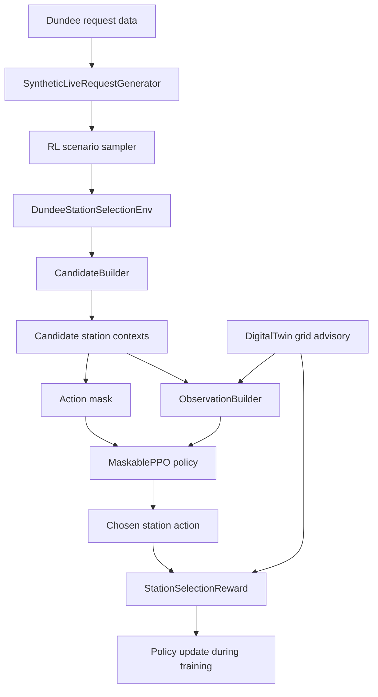
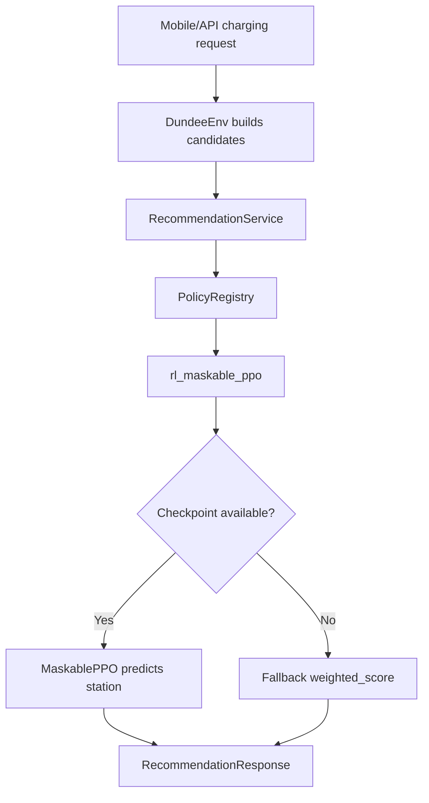
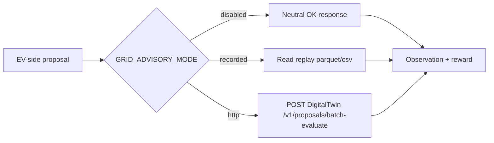

# EV-Side RL And Grid Advisory Lab Walkthrough

This file explains the EV-side reinforcement-learning setup that was added for
station recommendation, how it connects to the DigitalTwin grid advisory API,
how to trace it, and how to train it manually when you are ready.

The short version:

- The RL agent does not predict voltage or demand.
- The RL agent predicts which Dundee charging station should receive one EV request.
- The action is a station index.
- The action mask blocks impossible stations.
- The reward teaches the agent to prefer stations that are feasible, cheap, close, fast, low-wait, and grid-safer.
- DigitalTwin supplies grid advisory features through `disabled`, `recorded`, or `http` modes.

## Important Roots

EV-side root:

```powershell
A:\coding\Projects\USSEE\Implementations\DigitalTwin.2.0\EV-side\ev-smart-charging-MARL\ev-smart-charging-MARL
```

DigitalTwin root:

```powershell
A:\coding\Projects\USSEE\Implementations\DigitalTwin.2.0
```

Main notebook:

```powershell
A:\coding\Projects\USSEE\Implementations\DigitalTwin.2.0\EV-side\ev-smart-charging-MARL\ev-smart-charging-MARL\notebooks\EV_Side_MaskablePPO_Grid_Advisory_Runbook.ipynb
```

## What Was Built

### EV-Side RL Pieces

| Piece | Path | What it does |
| --- | --- | --- |
| RL environment | `packages/ev_core/src/ev_core/rl/env.py` | Gymnasium-style station-selection environment. One step means one request decision. |
| Observation builder | `packages/ev_core/src/ev_core/rl/observations.py` | Builds the numeric vector the neural network sees. |
| Reward model | `packages/ev_core/src/ev_core/rl/rewards.py` | Converts one station choice into reward. |
| Grid advisory client package | `packages/ev_core/src/ev_core/grid_advisory/` | Contracts and clients for disabled, recorded replay, and HTTP grid modes. |
| Runtime RL policy | `packages/ev_core/src/ev_core/recommender/rl_policy.py` | Loads a MaskablePPO checkpoint when available, otherwise falls back safely. |
| Policy registry wiring | `packages/ev_core/src/ev_core/recommender/policy_registry.py` | Adds `rl_maskable_ppo` as a selectable recommendation policy. |
| Training script | `scripts/rl_training/train_maskable_ppo_station_selector.py` | Runs MaskablePPO training when dependencies are installed. |
| Evaluation script | `scripts/rl_training/evaluate_maskable_ppo_station_selector.py` | Loads a checkpoint and evaluates it against validation scenarios. |
| Notebook runbook | `notebooks/EV_Side_MaskablePPO_Grid_Advisory_Runbook.ipynb` | Safe notebook walkthrough. `RUN_TRAINING = False` by default. |

### DigitalTwin Pieces

| Piece | Path | What it does |
| --- | --- | --- |
| Grid advisory API app | `A:\coding\Projects\USSEE\Implementations\DigitalTwin.2.0\src\grid_advisory\api.py` | FastAPI app with `/v1` advisory endpoints. |
| Advisory service logic | `A:\coding\Projects\USSEE\Implementations\DigitalTwin.2.0\src\grid_advisory\service.py` | Uses recorded replay if available, otherwise deterministic `mock_local_v1`. |
| API server script | `A:\coding\Projects\USSEE\Implementations\DigitalTwin.2.0\scripts\serve_grid_advisory_api.py` | Starts local DigitalTwin advisory API. |
| Replay export script | `A:\coding\Projects\USSEE\Implementations\DigitalTwin.2.0\scripts\export_evside_grid_advisory_replay.py` | Creates local replay files from EV-side Dundee station data. |

## What The RL Agent Is Actually Doing

For each EV charging request, the agent receives:

1. request features
2. station candidate features
3. action mask
4. optional grid advisory features

Then it outputs:

```text
station_action_index
```

That index maps to one station id in a deterministic station list:

```python
env.station_ids[action_index]
```

So the model is learning:

```text
"Given this EV request and these station/grid conditions, which feasible station should I recommend?"
```

It is not learning:

- to simulate power flow
- to forecast voltage directly
- to generate customer demand
- to optimize a full multi-hour charging schedule
- to control charger power step by step

Those can come later. V1 is intentionally station choice.

## Full Pipeline



At runtime after training:



Grid advisory modes:



## Data Used

| Need | Source | Current use |
| --- | --- | --- |
| Customer requests | EV-side Dundee processed replay and synthetic-live generator | Generates scenario requests for training/evaluation. |
| Stations | EV-side `data/processed/station_master.csv` | Fixed station action space. |
| Chargepoints/connectors | EV-side `data/processed/chargepoint_master.csv` | Compatibility and duration estimates. |
| Tariffs/prices | EV-side pricing code and `price_table_15min.csv` | Candidate cost and reward cost penalty. |
| Queue/utilization | EV-side runtime state | Candidate wait/utilization features. |
| Distance/routing | EV-side routing provider | Default is `simple_distance`; OSMnx optional. |
| Synthetic EV topology | EV-side processed transformers/zones | Debug/headroom scaffolding only. |
| Grid voltage/loading/risk | DigitalTwin advisory API or replay | Grid advisory features and reward terms. |

The important rule:

```text
EV-side owns customer/station/recommendation behavior.
DigitalTwin owns physical grid advisory behavior.
```

## Observation: What The Neural Network Sees

The observation is a flat `float32` vector.

Global request/time features:

- time of day as sine/cosine
- requested energy
- slack until latest finish
- charger preference one-hot
- current SOC
- target SOC
- battery size
- vehicle AC max
- vehicle DC max

Per station, repeated for every station:

- distance
- estimated wait
- estimated charging duration
- estimated cost
- transformer headroom
- current queue
- utilization
- charger compatible flag
- action-mask flag
- grid advisory available flag
- grid verdict code
- grid risk class code
- minimum voltage
- max line loading
- max transformer loading
- stress score
- max allowed kW
- out-of-distribution flag
- uncertainty flag

The code is here:

```text
packages/ev_core/src/ev_core/rl/observations.py
```

## Action Mask: Why MaskablePPO Is Used

The action space is:

```text
Discrete(number_of_stations)
```

But not every station is possible for every request. A station can be invalid because:

- wrong charger type
- no compatible available connector
- cannot finish before the customer deadline
- station is excluded by access rules
- candidate builder did not return it as feasible

The action mask is a boolean list:

```python
[True, False, True, ...]
```

`True` means the station can be selected. `False` means the model must not choose it.

This is why the first training algorithm is MaskablePPO from `sb3-contrib`. It is PPO, but it understands invalid actions.

## Reward: What The Agent Learns To Prefer

The reward starts with:

```text
+1.0 for serving a request
```

Then it subtracts penalties for:

- invalid action
- missed request
- high cost
- long distance
- long wait
- long duration
- low headroom
- grid caution/reject/violation/uncertainty

Grid reward terms:

| Grid response | Reward effect |
| --- | --- |
| `OK` + `SAFE` | Small positive bonus |
| `CAUTIOUS` | Penalty |
| `REJECT` | Strong penalty |
| `VIOLATION` | Strong extra penalty |
| `ood_flag` or `uq_flag` | Uncertainty penalty |

This means grid caution is a training signal, not a hard mask. The agent is still allowed to learn tradeoffs, but it is punished for grid-risky choices.

The code is here:

```text
packages/ev_core/src/ev_core/rl/rewards.py
packages/ev_core/src/ev_core/grid_advisory/reward_terms.py
```

## API Contract Between EV-Side And DigitalTwin

EV-side sends one station/time/energy proposal:

```json
{
  "request_id": "rl_request_001",
  "episode_id": "rl_train_001",
  "station_id": "dundee_station_id",
  "area_id": "digitaltwin_area_id",
  "start_timestamp": "2024-03-15T18:00:00Z",
  "timebase_minutes": 30,
  "duration_steps": 4,
  "requested_energy_kwh": 30.0,
  "charger_kw": 22.0,
  "ev_schedule": [
    {"time_index": 0, "p_kw": 22.0, "q_kvar": 0.0}
  ]
}
```

DigitalTwin returns:

```json
{
  "verdict": "OK",
  "risk_class": "SAFE",
  "v_min_pu": 0.97,
  "max_line_loading_percent": 80.0,
  "max_trafo_loading_percent": 75.0,
  "stress_score": 0.2,
  "max_allowed_kw": 22.0,
  "ood_flag": false,
  "uq_flag": false,
  "reason_codes": ["voltage_margin_ok"],
  "model_version": "mock_local_v1",
  "advisory_available": true
}
```

Endpoints:

```text
GET  /v1/health
GET  /v1/model-card
POST /v1/proposals/evaluate
POST /v1/proposals/batch-evaluate
POST /v1/constraints/envelope
```

## Lab Setup

Use Python 3.11 or 3.12 for RL training. Avoid Python 3.14 for now because PyTorch/SB3 wheels may not be ready for it.

From the EV-side root:

```powershell
cd A:\coding\Projects\USSEE\Implementations\DigitalTwin.2.0\EV-side\ev-smart-charging-MARL\ev-smart-charging-MARL
py -3.12 -m venv .venv-rl
.\.venv-rl\Scripts\python -m pip install --upgrade pip
.\.venv-rl\Scripts\python -m pip install -r requirements.txt
```

If `py -3.12` is not available, use the installed Python 3.12 path directly:

```powershell
C:\Users\youss\AppData\Local\Programs\Python\Python312\python.exe -m venv .venv-rl
.\.venv-rl\Scripts\python -m pip install --upgrade pip
.\.venv-rl\Scripts\python -m pip install -r requirements.txt
```

Check packages with PowerShell:

```powershell
@'
import importlib.util
for name in ["gymnasium", "stable_baselines3", "sb3_contrib", "tensorboard"]:
    print(name, bool(importlib.util.find_spec(name)))
'@ | .\.venv-rl\Scripts\python -
```

Expected:

```text
gymnasium True
stable_baselines3 True
sb3_contrib True
tensorboard True
```

## Lab 1: Run The Safe Notebook

Open:

```text
notebooks/EV_Side_MaskablePPO_Grid_Advisory_Runbook.ipynb
```

Keep:

```python
RUN_TRAINING = False
```

Run the cells. The notebook will:

1. explain the agent/environment/action/mask/reward
2. check dependency availability
3. count Dundee data rows
4. create the environment in `disabled` grid mode if Gymnasium is installed
5. show observation shape
6. show action mask
7. run a short random-valid rollout
8. try the local DigitalTwin grid advisory API if it is running
9. print the exact training command

This is the best first place to learn the code without training.

## Lab 2: Dry-Run The Training Script

This verifies setup without training:

```powershell
cd A:\coding\Projects\USSEE\Implementations\DigitalTwin.2.0\EV-side\ev-smart-charging-MARL\ev-smart-charging-MARL
.\.venv-rl\Scripts\python scripts\rl_training\train_maskable_ppo_station_selector.py --dry-run --scenario-count 1
```

Expected result:

```text
dry_run: no training performed
```

This checks:

- data can load
- scenarios can sample
- dependencies are visible
- environment can be created if Gymnasium is installed

## Lab 3: Start DigitalTwin Grid Advisory API

From DigitalTwin root:

```powershell
cd A:\coding\Projects\USSEE\Implementations\DigitalTwin.2.0
python scripts\serve_grid_advisory_api.py --port 8091
```

Health check in a second terminal:

```powershell
Invoke-RestMethod http://127.0.0.1:8091/v1/health
```

Expected:

```text
status = ok
service = digitaltwin_grid_advisory
model_version = mock_local_v1
```

This API is local V1. If no replay is supplied, it returns deterministic mock advisory results clearly labeled `mock_local_v1`.

## Lab 4: Export A Recorded Advisory Replay

From DigitalTwin root:

```powershell
cd A:\coding\Projects\USSEE\Implementations\DigitalTwin.2.0
python scripts\export_evside_grid_advisory_replay.py `
  --evside-root A:\coding\Projects\USSEE\Implementations\DigitalTwin.2.0\EV-side\ev-smart-charging-MARL\ev-smart-charging-MARL `
  --output-dir outputs\grid_advisory_replay `
  --max-rows 1000
```

It writes:

```text
outputs/grid_advisory_replay/advisory_dataset_manifest.json
outputs/grid_advisory_replay/station_area_mapping.parquet
outputs/grid_advisory_replay/rl_candidate_advisory.parquet
outputs/grid_advisory_replay/constraint_envelopes.parquet
outputs/grid_advisory_replay/rl_episode_catalog.parquet
outputs/grid_advisory_replay/model_card.json
```

Then serve with replay:

```powershell
python scripts\serve_grid_advisory_api.py --port 8091 --replay-dir outputs\grid_advisory_replay
```

## Lab 5: Train With Grid Disabled

This is the simplest first training run.

From EV-side root:

```powershell
cd A:\coding\Projects\USSEE\Implementations\DigitalTwin.2.0\EV-side\ev-smart-charging-MARL\ev-smart-charging-MARL
.\.venv-rl\Scripts\python scripts\rl_training\train_maskable_ppo_station_selector.py `
  --repo-root . `
  --output-dir models\rl `
  --tensorboard-log outputs\rl\tensorboard `
  --total-timesteps 10000 `
  --seed-start 1000 `
  --scenario-count 4 `
  --grid-advisory-mode disabled
```

Output checkpoint:

```text
models/rl/maskable_ppo_station_selector.zip
```

This trains the station selector using EV-side customer/station/tariff/routing/queue features, with neutral grid advice.

## Lab 6: Train With Local DigitalTwin HTTP Advisory

Terminal 1, start DigitalTwin:

```powershell
cd A:\coding\Projects\USSEE\Implementations\DigitalTwin.2.0
python scripts\serve_grid_advisory_api.py --port 8091
```

Terminal 2, train EV-side:

```powershell
cd A:\coding\Projects\USSEE\Implementations\DigitalTwin.2.0\EV-side\ev-smart-charging-MARL\ev-smart-charging-MARL
.\.venv-rl\Scripts\python scripts\rl_training\train_maskable_ppo_station_selector.py `
  --repo-root . `
  --output-dir models\rl `
  --tensorboard-log outputs\rl\tensorboard `
  --total-timesteps 10000 `
  --seed-start 1000 `
  --scenario-count 4 `
  --grid-advisory-mode http `
  --grid-advisory-base-url http://127.0.0.1:8091
```

This makes EV-side call DigitalTwin while building candidate observations and rewards.

## Lab 7: Train With Recorded Replay

First export replay using Lab 4.

Then:

```powershell
cd A:\coding\Projects\USSEE\Implementations\DigitalTwin.2.0\EV-side\ev-smart-charging-MARL\ev-smart-charging-MARL
.\.venv-rl\Scripts\python scripts\rl_training\train_maskable_ppo_station_selector.py `
  --repo-root . `
  --output-dir models\rl `
  --tensorboard-log outputs\rl\tensorboard `
  --total-timesteps 10000 `
  --seed-start 1000 `
  --scenario-count 4 `
  --grid-advisory-mode recorded `
  --grid-replay-dir A:\coding\Projects\USSEE\Implementations\DigitalTwin.2.0\outputs\grid_advisory_replay
```

Recorded replay mode is faster and more stable than HTTP mode for longer training.

## Lab 8: Watch Training With TensorBoard

From EV-side root:

```powershell
.\.venv-rl\Scripts\python -m tensorboard.main --logdir outputs\rl\tensorboard --port 6006
```

Open:

```text
http://127.0.0.1:6006
```

Watch:

- rollout reward
- episode length
- policy loss
- value loss
- entropy

Early training may look noisy. That is normal. You mainly want to see that it is learning without crashing and that reward does not collapse.

## Lab 9: Evaluate A Checkpoint

After training:

```powershell
cd A:\coding\Projects\USSEE\Implementations\DigitalTwin.2.0\EV-side\ev-smart-charging-MARL\ev-smart-charging-MARL
.\.venv-rl\Scripts\python scripts\rl_training\evaluate_maskable_ppo_station_selector.py `
  --checkpoint-path models\rl\maskable_ppo_station_selector.zip `
  --seed 2000 `
  --duration-hours 1 `
  --demand-level normal `
  --grid-advisory-mode disabled
```

Use validation seeds first:

```text
2000-2099
```

Use test seeds only when you are done tuning:

```text
3000-3099
```

## Lab 10: Use A Trained Checkpoint In The Runtime API

Set environment variables before starting the EV-side API/runtime:

```powershell
$env:RECOMMENDATION_POLICY_NAME = "rl_maskable_ppo"
$env:RL_POLICY_CHECKPOINT_PATH = "models\rl\maskable_ppo_station_selector.zip"
$env:RL_FALLBACK_POLICY_NAME = "weighted_score"
$env:GRID_ADVISORY_MODE = "http"
$env:GRID_ADVISORY_BASE_URL = "http://127.0.0.1:8091"
```

If the checkpoint or SB3 dependencies are missing, the runtime policy falls back to `weighted_score` unless fail-closed is enabled.

Fail-safe default:

```powershell
$env:RL_POLICY_FAIL_CLOSED = "false"
```

Only use this if you explicitly want no recommendation when RL fails:

```powershell
$env:RL_POLICY_FAIL_CLOSED = "true"
```

## How To Train With Codex Watching

You can ask Codex to monitor training, but you should still start the training command explicitly so you know exactly what is running.

Recommended pattern:

1. Tell Codex the command you want to run.
2. Ask Codex to run it with a modest timestep count first.
3. Ask Codex to watch logs and stop if it crashes.
4. Increase timesteps only after the smoke run is clean.

Example:

```text
Run this training command for 10,000 timesteps, do not change code, and summarize errors or TensorBoard/log output:
.\.venv-rl\Scripts\python scripts\rl_training\train_maskable_ppo_station_selector.py --total-timesteps 10000 --scenario-count 4 --grid-advisory-mode disabled
```

For a longer run:

```text
Run the same training command for 200,000 timesteps and report progress every few minutes. Do not modify code while training unless it crashes.
```

## How To Trace A Decision

### In The Environment

Create env:

```python
from pathlib import Path
from ev_core.data.repositories import DundeeSimulationRepository
from ev_core.rl.env import DundeeStationSelectionEnv
from ev_core.rl.scenarios import RLScenarioSampler

repo_root = Path(r"A:\coding\Projects\USSEE\Implementations\DigitalTwin.2.0\EV-side\ev-smart-charging-MARL\ev-smart-charging-MARL")
bundle = DundeeSimulationRepository(repo_root).load_bundle()
scenario = RLScenarioSampler(bundle=bundle).sample(seed=1000, split="train", duration_hours=1, demand_level="normal")
env = DundeeStationSelectionEnv(repo_root=repo_root, scenario=scenario, bundle=bundle, grid_advisory_mode="disabled")
obs, info = env.reset(seed=1000)
```

Inspect:

```python
print(env.station_ids)
print(env.action_masks())
print(env.current_request)
print(env.current_simulation_request)
print(env.current_candidate_contexts[:3])
print(env.current_grid_advisories)
```

Step:

```python
mask = env.action_masks()
action = next(index for index, allowed in enumerate(mask) if allowed)
obs, reward, terminated, truncated, info = env.step(action)
print(reward)
print(info["reward_breakdown"])
print(info["selected_station_id"])
print(info["selected_grid_advisory"])
```

### In The Recommendation Runtime

Policy selection flows through:

```text
RecommendationService
-> PolicyRegistry
-> MaskablePPORuntimePolicy or baseline policy
```

Important files:

```text
packages/ev_core/src/ev_core/recommender/service.py
packages/ev_core/src/ev_core/recommender/policy_registry.py
packages/ev_core/src/ev_core/recommender/rl_policy.py
packages/ev_core/src/ev_core/env/dundee_env.py
```

### In The DigitalTwin API

Health:

```powershell
Invoke-RestMethod http://127.0.0.1:8091/v1/health
```

Model card:

```powershell
Invoke-RestMethod http://127.0.0.1:8091/v1/model-card
```

Single proposal:

```powershell
$body = @{
  request_id = "trace_request_001"
  episode_id = "trace_episode"
  station_id = "station-a"
  area_id = "area-a"
  start_timestamp = "2024-03-15T18:00:00Z"
  timebase_minutes = 30
  duration_steps = 2
  requested_energy_kwh = 24.0
  charger_kw = 22.0
  ev_schedule = @(@{time_index = 0; p_kw = 22.0; q_kvar = 0.0})
} | ConvertTo-Json -Depth 5

Invoke-RestMethod `
  -Method Post `
  -Uri http://127.0.0.1:8091/v1/proposals/evaluate `
  -ContentType "application/json" `
  -Body $body
```

## How To Read A Training Result

After training, check:

1. Did the checkpoint exist?

```powershell
Test-Path models\rl\maskable_ppo_station_selector.zip
```

2. Did evaluation produce non-crashing rollout metrics?

```powershell
.\.venv-rl\Scripts\python scripts\rl_training\evaluate_maskable_ppo_station_selector.py --checkpoint-path models\rl\maskable_ppo_station_selector.zip
```

3. Did it avoid invalid actions?

Look for:

```text
invalid_actions = 0 or very low
```

4. Did reward improve over random-valid and deterministic baselines?

Current script gives checkpoint rollout metrics. A later benchmark script should compare:

- random_valid
- weighted_score
- closest
- cheapest
- fastest
- overload_aware
- rl_maskable_ppo

## Recommended Training Progression

Start small:

```text
10,000 timesteps
disabled grid
1-hour normal scenarios
```

Then:

```text
50,000 timesteps
disabled grid
normal + busy scenarios
```

Then:

```text
100,000-300,000 timesteps
recorded grid advisory
normal + busy + small stress slice
```

Then:

```text
HTTP advisory smoke only
short runs
confirm API stability
```

Do not start with a huge HTTP-based training run. HTTP is useful for integration, but recorded replay is usually better for longer training.

## Current Limitations

- V1 is single-agent station selection, not full MARL.
- V1 does not optimize the whole charging schedule.
- DigitalTwin API V1 is a local advisory service, not a full production oracle.
- `mock_local_v1` is deterministic integration data, not thesis-grade grid truth.
- Dundee-to-grid mapping is an integration/demo mapping unless replaced with a validated topology crosswalk.
- Existing environment in this workspace did not have Gymnasium/SB3 installed during implementation verification; install `requirements.txt` in a fresh RL venv before training.

## Quick Command Cheat Sheet

EV-side dry run:

```powershell
cd A:\coding\Projects\USSEE\Implementations\DigitalTwin.2.0\EV-side\ev-smart-charging-MARL\ev-smart-charging-MARL
.\.venv-rl\Scripts\python scripts\rl_training\train_maskable_ppo_station_selector.py --dry-run --scenario-count 1
```

DigitalTwin API:

```powershell
cd A:\coding\Projects\USSEE\Implementations\DigitalTwin.2.0
python scripts\serve_grid_advisory_api.py --port 8091
```

Train:

```powershell
cd A:\coding\Projects\USSEE\Implementations\DigitalTwin.2.0\EV-side\ev-smart-charging-MARL\ev-smart-charging-MARL
.\.venv-rl\Scripts\python scripts\rl_training\train_maskable_ppo_station_selector.py --total-timesteps 10000 --scenario-count 4 --grid-advisory-mode disabled
```

Evaluate:

```powershell
.\.venv-rl\Scripts\python scripts\rl_training\evaluate_maskable_ppo_station_selector.py --checkpoint-path models\rl\maskable_ppo_station_selector.zip
```

TensorBoard:

```powershell
.\.venv-rl\Scripts\python -m tensorboard.main --logdir outputs\rl\tensorboard --port 6006
```

Use checkpoint in runtime:

```powershell
$env:RECOMMENDATION_POLICY_NAME = "rl_maskable_ppo"
$env:RL_POLICY_CHECKPOINT_PATH = "models\rl\maskable_ppo_station_selector.zip"
$env:RL_FALLBACK_POLICY_NAME = "weighted_score"
```

## Mental Model To Keep

Think of the agent like a dispatcher:

```text
A customer asks to charge.
The system lists stations that could realistically serve them.
DigitalTwin tells us if any choice is grid-risky.
The RL agent chooses one feasible station.
The reward says whether that choice was good or bad.
After many episodes, the model should learn better station choices than simple rules.
```

That is the whole first RL target.
