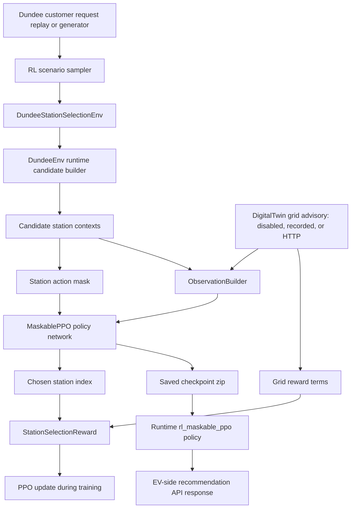
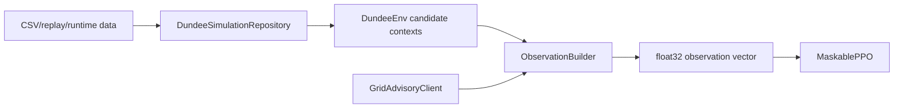
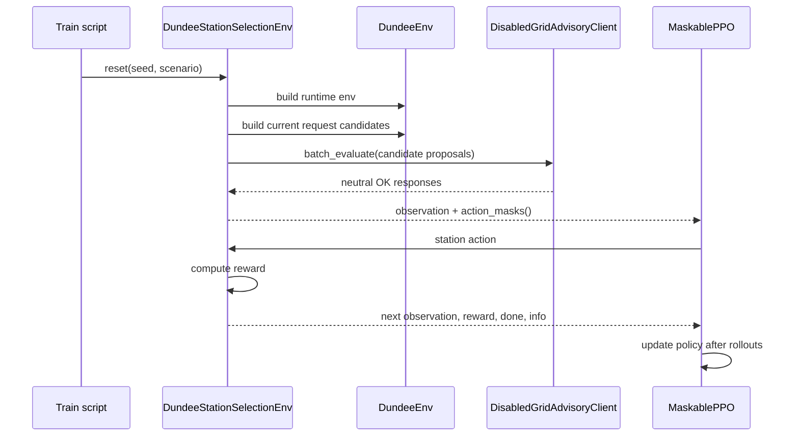
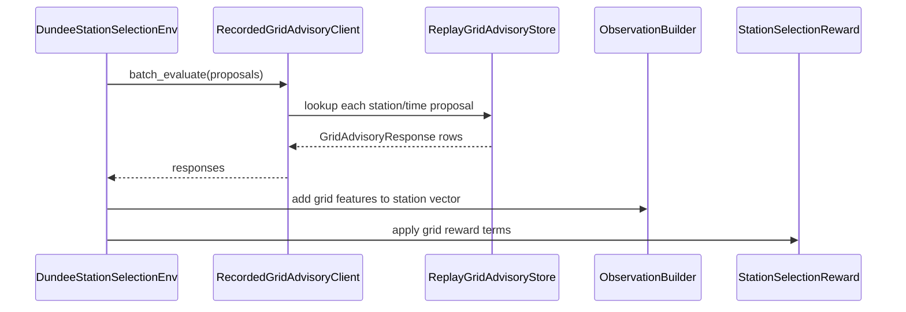
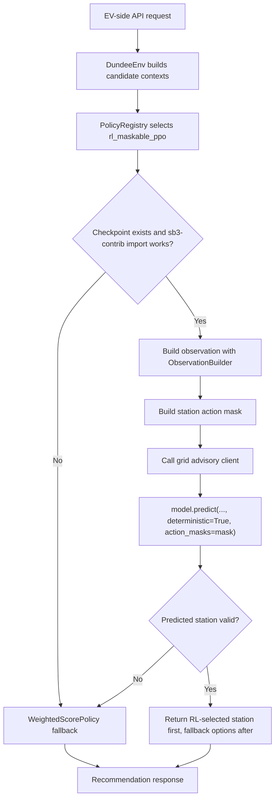

# EV-Side RL Master Curriculum And Code Reading Manual

Date: 2026-06-04

This is the deep curriculum for understanding the EV-side reinforcement learning
work that was added around Dundee station selection and the local DigitalTwin
grid-advisory API.

Use this file as a lab manual, not just as documentation. The goal is that you
can open the code, recognize every moving part, understand why it exists, run the
safe checks, train manually when ready, and then confidently evolve the design
toward stronger RL or later multi-agent RL.

## 0. What This Curriculum Is For

You asked for more than a walkthrough. This document is designed as a learning
path:

1. Learn the reinforcement learning fundamentals used here.
2. Learn the tools and why each tool was chosen.
3. Map each concept to the exact implementation file.
4. Run labs that show the system working without accidentally training.
5. Learn how to train manually when you decide to start.
6. Learn how to trace a recommendation from API request to chosen station.
7. Learn how to safely change observation features, reward terms, masks, grid
   advisory behavior, and later the whole setup toward MARL.

The important mental model:

```text
The RL model is a station-selection policy.

It is not a voltage predictor.
It is not a power-flow solver.
It is not a full charger schedule optimizer yet.
It is not a multi-agent fleet controller yet.

For V1, one step = one customer request.
The action = choose one Dundee station.
The action mask = which stations are impossible right now.
The reward = how good or bad that station choice was.
The DigitalTwin side supplies grid risk, not EV-side synthetic grid truth.
```

## 1. Project Roots

EV-side project root:

```powershell
A:\coding\Projects\USSEE\Implementations\DigitalTwin.2.0\EV-side\ev-smart-charging-MARL\ev-smart-charging-MARL
```

DigitalTwin project root:

```powershell
A:\coding\Projects\USSEE\Implementations\DigitalTwin.2.0
```

Main notebook:

```powershell
A:\coding\Projects\USSEE\Implementations\DigitalTwin.2.0\EV-side\ev-smart-charging-MARL\ev-smart-charging-MARL\notebooks\EV_Side_MaskablePPO_Grid_Advisory_Runbook.ipynb
```

Shorter quick walkthrough:

```powershell
A:\coding\Projects\USSEE\Implementations\DigitalTwin.2.0\EV-side\ev-smart-charging-MARL\ev-smart-charging-MARL\docs\ai_context\EV_SIDE_RL_GRID_ADVISORY_LAB_WALKTHROUGH.md
```

This deeper curriculum:

```powershell
A:\coding\Projects\USSEE\Implementations\DigitalTwin.2.0\EV-side\ev-smart-charging-MARL\ev-smart-charging-MARL\docs\ai_context\EV_SIDE_RL_MASTER_CURRICULUM_AND_CODE_READING_MANUAL.md
```

## 2. Learning Outcomes

After reading and doing the labs, you should be able to answer:

- What does the EV-side RL agent actually do?
- What is an environment, observation, action, mask, reward, episode, rollout,
  policy, checkpoint, and evaluation run?
- Why did we use Gymnasium, Stable-Baselines3, sb3-contrib MaskablePPO,
  TensorBoard, FastAPI, Pydantic, and Parquet?
- What is the difference between PPO and MaskablePPO?
- What is the difference between a hard action mask and a soft reward penalty?
- Which data is EV-side truth and which data must come from DigitalTwin?
- How does EV-side call the local DigitalTwin grid advisory API?
- What exactly does each training CLI argument mean?
- How do you trace one station decision through the code?
- How do you safely change the reward or observation without breaking the model?
- What would need to change to move from single-agent RL to multi-agent RL?

## 3. The Big Picture In One Diagram



Read this diagram from left to right:

- Dundee data creates customer charging requests.
- The EV-side runtime builds candidate station options.
- The action mask says which stations are possible.
- The observation vector gives the policy numbers describing the request and all
  stations.
- DigitalTwin grid advisory adds grid-safety context.
- MaskablePPO chooses one station.
- The reward says whether that choice was good enough.
- Training updates the policy.
- After training, the checkpoint can be loaded by the recommender API.

## 4. What Was Actually Built

### 4.1 EV-side files

| Area | File or package | Why it matters |
| --- | --- | --- |
| RL environment | `packages/ev_core/src/ev_core/rl/env.py` | The Gymnasium environment. One `step(action)` means one station decision. |
| Observations | `packages/ev_core/src/ev_core/rl/observations.py` | Builds the numeric vector the neural network sees. |
| Action masks | `packages/ev_core/src/ev_core/rl/action_mask.py` | Converts feasible station candidates into true/false action availability. |
| Rewards | `packages/ev_core/src/ev_core/rl/rewards.py` | Converts the selected station into reward terms. |
| Scenarios | `packages/ev_core/src/ev_core/rl/scenarios.py` | Samples train/validation Dundee operating windows and requests. |
| Grid contracts | `packages/ev_core/src/ev_core/grid_advisory/contracts.py` | Pydantic request/response models shared conceptually with DigitalTwin. |
| Grid clients | `packages/ev_core/src/ev_core/grid_advisory/client.py` | Disabled, recorded replay, and HTTP clients for grid advice. |
| Replay store | `packages/ev_core/src/ev_core/grid_advisory/replay_store.py` | Reads advisory replay rows from Parquet or CSV. |
| Proposal mapping | `packages/ev_core/src/ev_core/grid_advisory/feature_mapping.py` | Converts one candidate station into a grid proposal payload. |
| Grid reward terms | `packages/ev_core/src/ev_core/grid_advisory/reward_terms.py` | Converts OK/CAUTIOUS/REJECT and risk flags into soft reward shaping. |
| Runtime RL policy | `packages/ev_core/src/ev_core/recommender/rl_policy.py` | Loads a MaskablePPO checkpoint for API-time recommendation. |
| Policy registry | `packages/ev_core/src/ev_core/recommender/policy_registry.py` | Registers `rl_maskable_ppo` as a selectable policy. |
| Recommender service | `packages/ev_core/src/ev_core/recommender/service.py` | Passes runtime context so RL can build the same observation as training. |
| Training script | `scripts/rl_training/train_maskable_ppo_station_selector.py` | Creates scenarios, builds env, trains MaskablePPO when not in dry run. |
| Evaluation script | `scripts/rl_training/evaluate_maskable_ppo_station_selector.py` | Loads a checkpoint and evaluates it on validation scenarios. |
| Notebook | `notebooks/EV_Side_MaskablePPO_Grid_Advisory_Runbook.ipynb` | Safe lab notebook with training guarded by `RUN_TRAINING = False`. |

### 4.2 DigitalTwin-side files

| Area | File | Why it matters |
| --- | --- | --- |
| API app | `A:\coding\Projects\USSEE\Implementations\DigitalTwin.2.0\src\grid_advisory\api.py` | FastAPI endpoints used by EV-side HTTP mode. |
| API service | `A:\coding\Projects\USSEE\Implementations\DigitalTwin.2.0\src\grid_advisory\service.py` | Uses replay if present, otherwise deterministic `mock_local_v1`. |
| API contracts | `A:\coding\Projects\USSEE\Implementations\DigitalTwin.2.0\src\grid_advisory\contracts.py` | DigitalTwin-side Pydantic models. |
| Server script | `A:\coding\Projects\USSEE\Implementations\DigitalTwin.2.0\scripts\serve_grid_advisory_api.py` | Starts the local advisory API. |
| Replay export | `A:\coding\Projects\USSEE\Implementations\DigitalTwin.2.0\scripts\export_evside_grid_advisory_replay.py` | Creates local replay package for `recorded` mode. |

## 5. Source Of Truth Rule

This is one of the most important architecture rules in the whole project.

```text
EV-side owns the customer-facing charging decision.
DigitalTwin owns electrical and physical grid truth.
```

Use EV-side data for:

- Dundee station identity.
- Dundee chargepoint inventory.
- Customer charging requests.
- User preference, tariff, travel distance, and queue estimates.
- Vehicle battery and charger compatibility.
- Recommendation policies and RL training loops.

Use DigitalTwin data for:

- Voltage limits.
- Line loading.
- Transformer loading.
- Physical headroom.
- SAFE / NEAR / VIOLATION risk labels.
- OOD and UQ flags.
- Final grid advisory verdicts.
- Station-to-grid-area mapping, once validated.

Do not treat EV-side synthetic transformers or zones as final physical grid
truth. They can support debugging when grid advisory is disabled, but the
electrical meaning should come from DigitalTwin.

This rule came from the local integration plan and the Gemini tooling research:

- `A:\coding\Projects\USSEE\Implementations\DigitalTwin.2.0\docs\obsidian\smart_grid_ev_load_integration_rebuild\43_EV_Side_MaskablePPO_Grid_API_Integration_Plan.md`
- `A:\coding\Projects\USSEE\Implementations\DigitalTwin.2.0\docs\obsidian\smart_grid_ev_load_integration_rebuild\44_EV_Side_RL_Tooling_Requirements_And_Gemini_Research_Prompt.md`
- `C:\Users\youss\Downloads\EV RL Tooling Stack Recommendation.md`

## 6. Reinforcement Learning Fundamentals

### 6.1 What is an agent?

In reinforcement learning, an agent is the decision-maker.

In this project:

```text
agent = the EV-side station recommender policy
```

It sees a charging request and station context, then chooses one station.

This is not a genetic algorithm. If you use the phrase "genetic agent" to mean
"generic EV decision agent," that is fine conversationally. In the code, though,
the implemented agent is a policy trained with PPO-style reinforcement learning,
not a genetic algorithm population.

### 6.2 What is an environment?

The environment is the world the agent interacts with.

In this project:

```text
environment = DundeeStationSelectionEnv
file = packages/ev_core/src/ev_core/rl/env.py
```

The environment controls:

- when an episode starts,
- what request is currently active,
- which stations are candidates,
- what the observation looks like,
- which station actions are valid,
- what reward is returned after the agent chooses,
- when the episode is over.

Gymnasium defines the modern environment API:

```python
obs, info = env.reset(seed=seed)
obs, reward, terminated, truncated, info = env.step(action)
```

Reference: Gymnasium environment API and custom environment tutorials are listed
in the source section at the end of this file.

### 6.3 What is a state?

The true state is everything about the world at that moment.

For this project, the true state could include:

- the current timestamp,
- all pending requests,
- all station queues,
- all chargepoint sessions,
- all tariffs,
- all route estimates,
- all local grid constraints,
- all hidden future requests.

The agent usually does not see the complete true state.

### 6.4 What is an observation?

The observation is the numeric representation we give the model.

In this project:

```text
observation = global request features + station-by-station features
file = packages/ev_core/src/ev_core/rl/observations.py
```

The observation is a flat NumPy vector because Stable-Baselines3 works very
comfortably with numeric `Box` spaces.

Current observation shape:

```text
vector_size = 12 global features + station_count * 19 station features
```

If Dundee has 35 stations:

```text
12 + 35 * 19 = 677 numeric values
```

The exact station count comes from `station_master.csv` loaded by the EV-side
repository, so do not hard-code 677 in your own experiments. Use the environment
or `ObservationBuilder.spec.vector_size`.

### 6.5 What is an action?

The action is the decision the agent makes.

In this project:

```text
action = integer station index
action_space = Discrete(number_of_stations)
```

Example:

```text
station_ids = ["station_A", "station_B", "station_C"]
action = 1
chosen station = station_B
```

The model does not output a station ID string directly. It outputs an integer.
The environment maps that integer to a station ID using the deterministic
`env.station_ids` list.

### 6.6 What is an action mask?

The action mask is a true/false list saying which actions are allowed right now.

Example:

```text
station_ids = ["station_A", "station_B", "station_C"]
action_mask = [true, false, true]
```

This means:

- station_A is allowed,
- station_B is impossible for this request,
- station_C is allowed.

In this project:

```text
file = packages/ev_core/src/ev_core/rl/action_mask.py
function = build_station_action_mask
```

The mask is aligned with the station list. If a station appears in the candidate
contexts built by DundeeEnv, it is valid. If it does not appear, it is invalid.

Important:

```text
Hard mask = impossible station actions only.
Grid CAUTIOUS / REJECT = soft training penalty, not a hard mask in V1.
```

Why? Because if you mask all grid-risky stations, the agent never learns why
grid risk is bad. It only learns that those choices disappeared. During training,
we want it to experience the consequence through reward.

### 6.7 What is reward?

Reward is the score returned after the agent acts.

In this project:

```text
file = packages/ev_core/src/ev_core/rl/rewards.py
class = StationSelectionReward
```

The reward says:

- positive if the request was served,
- negative if the action was invalid,
- negative if the request was missed,
- negative for high cost,
- negative for long distance,
- negative for long wait,
- negative for long charging duration,
- negative for low local headroom,
- grid bonus or penalties from advisory response.

Current high-level reward formula:

```text
total =
  served_reward
  + cost_penalty
  + distance_penalty
  + wait_penalty
  + duration_penalty
  + headroom_penalty
  + grid_ok_bonus
  + grid_cautious_penalty
  + grid_reject_penalty
  + grid_violation_penalty
  + grid_uncertainty_penalty
```

The constants live in `StationSelectionReward` and `grid_reward_terms`.

### 6.8 What is an episode?

An episode is one full run through an operating window.

In this project:

```text
episode = one sampled Dundee operating window
step = one customer charging request inside that window
```

The scenario sampler chooses:

- start time,
- end time,
- demand level,
- seed,
- split, such as train or validation.

Then the environment generates requests for that window. Each request becomes
one decision step.

### 6.9 What is a policy?

A policy is the function that chooses actions.

In classical terms:

```text
policy(observation) -> action probabilities
```

In this project:

```text
MaskablePPO policy(observation, action_mask) -> station action
```

During training, it samples actions so it can explore.

During runtime deployment, it uses deterministic prediction:

```python
model.predict(observation, deterministic=True, action_masks=mask)
```

### 6.10 What is a checkpoint?

A checkpoint is the saved trained model.

In this project, the default checkpoint path is:

```powershell
A:\coding\Projects\USSEE\Implementations\DigitalTwin.2.0\EV-side\ev-smart-charging-MARL\ev-smart-charging-MARL\models\rl\maskable_ppo_station_selector.zip
```

The `.zip` is written by Stable-Baselines3 / sb3-contrib. The runtime
`rl_maskable_ppo` policy can load it later.

### 6.11 What is the agent predicting?

The word "predicting" can be confusing here.

The RL model is not predicting a continuous number like voltage or demand.
Instead, it is predicting/selecting the best action:

```text
input:
  request + station features + optional grid advisory features + action mask

output:
  one station action index
```

So, practically:

```text
The model predicts which station should be recommended.
```

## 7. Why This Is Single-Agent First

The repo name includes MARL, but the implemented V1 is single-agent.

That is intentional.

Single-agent V1:

```text
one request arrives -> one policy chooses one station
```

Future MARL:

```text
many EV agents or station/zone agents interact -> coordinated charging behavior
```

Why not start with MARL immediately?

- MARL needs a stable single-agent decision contract first.
- MARL needs stronger state mutation and queue/session interaction.
- MARL needs careful reward sharing and credit assignment.
- MARL needs a multi-agent environment interface, likely PettingZoo.
- Debugging MARL while also debugging grid API contracts is too much at once.

The local Gemini research recommended single-agent MaskablePPO as the first
practical milestone, with PettingZoo as a later path for MARL.

## 8. Tooling Curriculum

### 8.1 Python

Python is the language used by both sides of the work:

- EV-side simulation and recommender logic.
- Gymnasium RL environment.
- Stable-Baselines3 training.
- FastAPI local services.
- Pandas/Parquet data handling.

The EV-side root `pyproject.toml` currently says Python `>=3.12`. The
`ev_core` package says `>=3.9`. For this workspace, the safest practical path is:

```text
Use Python 3.12 first because the project root declares it.
Use Python 3.11 only if a specific RL dependency fails in your local setup.
```

### 8.2 NumPy

NumPy stores observations as numeric arrays.

Where used:

```text
packages/ev_core/src/ev_core/rl/env.py
packages/ev_core/src/ev_core/rl/observations.py
packages/ev_core/src/ev_core/recommender/rl_policy.py
```

Why it matters:

Stable-Baselines3 expects observations to be arrays that can become PyTorch
tensors. The observation builder returns:

```python
np.asarray(features, dtype=np.float32)
```

### 8.3 Gymnasium

Gymnasium defines the environment contract.

In our code:

```text
DundeeStationSelectionEnv inherits from gym.Env
action_space = spaces.Discrete(len(station_ids))
observation_space = spaces.Box(...)
reset() returns observation, info
step(action) returns observation, reward, terminated, truncated, info
```

Why it matters:

Stable-Baselines3 does not train directly on arbitrary Python functions. It
trains against environments that follow this contract.

What to read in code:

```text
packages/ev_core/src/ev_core/rl/env.py
```

What to read externally:

- Gymnasium environment API.
- Gymnasium custom environment tutorial.

### 8.4 Stable-Baselines3

Stable-Baselines3, often called SB3, provides mature PyTorch implementations of
reinforcement learning algorithms.

For this project, SB3 gives us:

- PPO training loop structure.
- Model saving and loading.
- TensorBoard logging integration.
- Predict API for runtime inference.
- Compatible interfaces for Gymnasium environments.

Why not write PPO manually?

Because PPO is easy to get subtly wrong. The training loop includes rollout
collection, value estimation, advantage calculation, clipping behavior, entropy,
policy loss, value loss, and checkpointing. For this thesis milestone, the
engineering value is in the EV/grid decision system, not in reimplementing PPO
from scratch.

### 8.5 sb3-contrib

`sb3-contrib` contains algorithms and extensions that are not in core SB3.

The important one here:

```text
MaskablePPO
```

MaskablePPO is PPO with invalid action masking support.

In training:

```python
from sb3_contrib import MaskablePPO

model = MaskablePPO(
    "MlpPolicy",
    env,
    verbose=1,
    seed=scenarios[0].seed,
    tensorboard_log=str(args.tensorboard_log),
)
```

In runtime:

```python
action, _state = model.predict(
    observation,
    deterministic=True,
    action_masks=np.asarray(action_mask, dtype=bool),
)
```

What makes MaskablePPO special:

- The neural network outputs a score for every station.
- The mask says which stations are invalid.
- Invalid actions are removed from the sampling distribution.
- The agent spends training time comparing feasible actions, not repeatedly
  crashing into impossible actions.

### 8.6 PPO

PPO means Proximal Policy Optimization.

The intuition:

```text
1. Run the current policy in the environment and collect experience.
2. Estimate which actions were better or worse than expected.
3. Update the policy, but not too aggressively.
4. Repeat.
```

The "proximal" part means PPO tries to avoid changing the policy too much in one
update. A huge policy jump can destroy previously learned behavior.

Simplified PPO idea:

```text
ratio = probability_new(action) / probability_old(action)
advantage = how much better this action was than expected

PPO improves actions with positive advantage
and discourages actions with negative advantage,
while clipping the ratio to prevent huge updates.
```

You do not need to memorize the formula before using the code. You do need to
understand this:

```text
PPO learns from trial and feedback.
MaskablePPO learns from trial and feedback while respecting invalid-action masks.
```

### 8.7 TensorBoard

TensorBoard is the first local training dashboard.

In our training script:

```text
--tensorboard-log outputs\rl\tensorboard
```

It helps you inspect:

- episode reward trend,
- policy loss,
- value loss,
- entropy,
- learning stability.

TensorBoard does not decide anything. It lets you see training behavior.

### 8.8 FastAPI

FastAPI is used for the local DigitalTwin grid advisory API.

In our code:

```text
A:\coding\Projects\USSEE\Implementations\DigitalTwin.2.0\src\grid_advisory\api.py
```

Endpoints:

```text
GET  /v1/health
GET  /v1/model-card
POST /v1/proposals/evaluate
POST /v1/proposals/batch-evaluate
POST /v1/constraints/envelope
```

Why FastAPI:

- Simple local HTTP service.
- Good Python typing support.
- Automatic validation through Pydantic models.
- Easy JSON contracts.
- Easy OpenAPI docs later.

### 8.9 Pydantic

Pydantic defines and validates structured payloads.

In our code:

```text
EV-side: packages/ev_core/src/ev_core/grid_advisory/contracts.py
Grid-side: A:\coding\Projects\USSEE\Implementations\DigitalTwin.2.0\src\grid_advisory\contracts.py
```

Example model:

```python
class GridScheduleProposal(BaseModel):
    request_id: str
    station_id: str
    area_id: str
    start_timestamp: datetime
    requested_energy_kwh: float = Field(ge=0.0)
    charger_kw: float = Field(ge=0.0)
```

Why it matters:

If EV-side sends a bad payload, the API can reject it before it becomes a
mysterious tensor error or grid-service error.

### 8.10 Parquet and PyArrow

Parquet is a columnar data format. PyArrow is one common engine used by Pandas to
read and write Parquet.

In our project:

```text
recorded advisory replay can be stored as rl_candidate_advisory.parquet
```

Why Parquet:

- Better typed data than CSV.
- More efficient for large tables.
- Good for offline replay packages.
- Works well with Pandas/PyArrow.

The export script falls back to CSV if Parquet writing fails.

### 8.11 Pandas

Pandas is used for station data, replay tables, and export artifacts.

In our code:

```text
DundeeSimulationRepository loads processed data.
ReplayGridAdvisoryStore reads advisory replay tables.
export_evside_grid_advisory_replay.py builds replay datasets.
```

### 8.12 pytest

pytest is used for tests.

It matters because RL systems are easy to break silently. The most important
tests are not "does the model train well?" but:

- observation size stays consistent,
- action mask aligns with station IDs,
- reward ordering is sensible,
- grid clients fallback safely,
- API contracts validate,
- runtime policy falls back if checkpoint/dependencies are missing.

### 8.13 Optuna

Optuna was recommended by Gemini for hyperparameter optimization, but it was not
added to the V1 implementation.

Use it later when you are ready to tune:

- learning rate,
- gamma,
- n_steps,
- batch_size,
- ent_coef,
- reward weights.

Do not start with Optuna. First prove one manual training run behaves.

### 8.14 W&B and MLflow

The Gemini research discussed W&B and MLflow for experiment tracking and model
artifact governance.

They were not added in V1.

Current V1 choice:

```text
Use local TensorBoard and local files first.
```

Add W&B or MLflow after:

- the model trains,
- reward curves are meaningful,
- datasets are stable,
- you need formal experiment comparison.

### 8.15 PettingZoo

PettingZoo is the likely future tool if this becomes real multi-agent RL.

Use PettingZoo later when the problem becomes:

- many EV agents acting in the same environment,
- station agents coordinating capacity,
- grid-zone agents sharing constraints,
- centralized training with decentralized execution.

Do not migrate to PettingZoo until the single-agent contract is stable.

## 9. PPO vs MaskablePPO vs MARL

### 9.1 Plain PPO

Plain PPO can choose any action in the discrete action space.

If there are 35 stations, plain PPO initially sees 35 possible choices, even if
only 4 stations are feasible for the current request.

That means it wastes training on invalid actions.

### 9.2 MaskablePPO

MaskablePPO receives:

```text
observation
action_mask
```

Then it samples only from valid actions.

This is excellent for station selection because:

- charger incompatibility is common,
- queue/deadline infeasibility is common,
- the action space is fixed,
- valid actions change per request.

### 9.3 MARL

MARL means multi-agent reinforcement learning.

Examples of future agents:

- one agent per EV request,
- one agent per station,
- one agent per grid zone,
- one central coordinator plus local station agents.

MARL is not just "bigger PPO." It changes:

- the environment interface,
- the reward design,
- credit assignment,
- state sharing,
- training stability,
- evaluation.

For this project, the correct path is:

```text
single-agent MaskablePPO V1
-> stronger closed-loop simulation
-> grid replay and API validation
-> baselines and ablations
-> optional MARL design with PettingZoo / CTDE
```

## 10. Data Curriculum

### 10.1 What data the RL uses

| Need | Source | Used for |
| --- | --- | --- |
| Customer requests | EV-side Dundee replay/generator | Steps inside RL episodes |
| Station catalog | EV-side `data/processed/station_master.csv` | Fixed action list |
| Chargepoints | EV-side `data/processed/chargepoint_master.csv` | Compatibility/candidate building |
| Station zones/transformers | EV-side processed topology files | Debug placeholder, not final grid truth |
| Tariffs and cost | EV-side runtime/candidate builder | Observation and reward |
| Routing distance | EV-side routing provider | Observation and reward |
| Queue/wait estimates | EV-side runtime/candidate builder | Observation and reward |
| Voltage/loading/risk | DigitalTwin advisory API or replay | Grid observation features and reward |
| Older grid advisory packages | `A:\coding\Projects\USSEE\Implementations\grid-ev-advisory\data` | Reference/schema inspiration only |

### 10.2 What data the model sees

The model sees numeric features. It does not directly read raw CSV rows.



### 10.3 Global observation features

The observation builder currently creates 12 global request/time features:

| Feature group | Meaning |
| --- | --- |
| `sin(hour)` and `cos(hour)` | Time of day as a smooth cycle |
| requested energy | How much energy the user wants |
| slack minutes | Time available before latest finish |
| charger preference one-hot | any/ac/rapid preference |
| current SOC | Current battery state of charge |
| target SOC | Desired battery state of charge |
| battery kWh | Vehicle battery capacity |
| vehicle max AC kW | AC charging capability |
| vehicle max DC kW | DC charging capability |

Why use sine/cosine for hour?

Because time wraps around. 23:30 and 00:00 are close in real time. A raw hour
number would make them look far apart. Sine/cosine keeps the circular structure.

### 10.4 Per-station observation features

Each station currently contributes 19 features:

| Index group | Meaning |
| --- | --- |
| distance | Driver travel effort |
| estimated wait | Queue pressure |
| estimated duration | Charging time |
| estimated cost | Tariff/user cost |
| transformer headroom | Local EV-side placeholder feature |
| current queue | Station congestion |
| utilization | Station usage pressure |
| charger compatible | Basic feasibility signal |
| action mask flag | Whether station is currently valid |
| grid advisory available | Whether grid signal exists |
| grid verdict code | OK/CAUTIOUS/REJECT encoded numerically |
| grid risk code | SAFE/NEAR/VIOLATION encoded numerically |
| v_min_pu | Minimum voltage per unit from advisory |
| line loading | Max line loading normalized by 100 |
| transformer loading | Max transformer loading normalized by 100 |
| stress score | Grid stress signal |
| max allowed kW | Conservative allowed charging power normalized |
| OOD flag | Out-of-distribution warning |
| UQ flag | Uncertainty warning |

Code:

```text
packages/ev_core/src/ev_core/rl/observations.py
```

### 10.5 Action data

The action list is deterministic:

```python
self.station_ids = sorted(self.bundle.stations["station_id"].astype(str).tolist())
```

This matters because model action index 7 only means the same station if the
station list is built in the same order during training and runtime.

If you ever change station filtering, station IDs, or sorting, old checkpoints
may no longer match the environment.

### 10.6 Reward data

Reward uses candidate context fields:

- `estimated_cost_gbp`
- `distance_km`
- `estimated_wait_minutes`
- `estimated_duration_minutes`
- `transformer_headroom_kw`

and grid advisory fields:

- `verdict`
- `risk_class`
- `ood_flag`
- `uq_flag`
- `advisory_available`

Code:

```text
packages/ev_core/src/ev_core/rl/rewards.py
packages/ev_core/src/ev_core/grid_advisory/reward_terms.py
```

## 11. Grid Advisory Modes

The EV-side grid client has three modes:

| Mode | Meaning | Best use |
| --- | --- | --- |
| `disabled` | Return neutral OK-like grid advice | First smoke tests and no-grid baseline |
| `recorded` | Read exported replay table from Parquet/CSV | Fast reproducible training with grid features |
| `http` | Call local DigitalTwin FastAPI service | Integration tests and runtime-like behavior |

### 11.1 Disabled mode

Disabled mode returns neutral responses:

```text
verdict = OK
risk_class = SAFE
advisory_available = false
model_version = disabled_grid_advisory
```

Use it to check the RL environment without grid complexity.

### 11.2 Recorded mode

Recorded mode reads replay data:

```text
grid_advisory_replay/
  advisory_dataset_manifest.json
  station_area_mapping.parquet or .csv
  rl_candidate_advisory.parquet or .csv
  constraint_envelopes.parquet or .csv
  rl_episode_catalog.parquet or .csv
  model_card.json
```

This is the best training mode once replay quality improves because it is:

- reproducible,
- faster than HTTP,
- easy to version,
- independent of live API uptime.

### 11.3 HTTP mode

HTTP mode calls:

```text
POST http://127.0.0.1:8091/v1/proposals/batch-evaluate
```

Use it when you want to prove EV-side and DigitalTwin can talk locally.

Do not use HTTP for long training until you measure performance. Many HTTP calls
inside RL training can be slow.

### 11.4 Current local DigitalTwin behavior

The DigitalTwin local service is not a final production grid oracle.

It does:

- use recorded replay if available,
- otherwise return deterministic mock responses labeled `mock_local_v1`,
- provide a model card explaining limitations,
- keep API integration testable.

Code:

```text
A:\coding\Projects\USSEE\Implementations\DigitalTwin.2.0\src\grid_advisory\service.py
```

## 12. API Contract Curriculum

### 12.1 EV-side proposal

EV-side sends one station/time/energy proposal:

```json
{
  "request_id": "rl_request_001",
  "episode_id": "rl_train_001",
  "station_id": "dundee_station_id",
  "area_id": "digitaltwin_area_id",
  "start_timestamp": "2024-03-15T18:00:00Z",
  "timebase_minutes": 30,
  "duration_steps": 4,
  "requested_energy_kwh": 30.0,
  "charger_kw": 22.0,
  "ev_schedule": [
    {"time_index": 0, "p_kw": 22.0, "q_kvar": 0.0}
  ]
}
```

### 12.2 Grid-side response

DigitalTwin returns:

```json
{
  "verdict": "OK",
  "risk_class": "SAFE",
  "v_min_pu": 0.97,
  "max_line_loading_percent": 80.0,
  "max_trafo_loading_percent": 75.0,
  "stress_score": 0.2,
  "max_allowed_kw": 22.0,
  "ood_flag": false,
  "uq_flag": false,
  "reason_codes": ["voltage_margin_ok"],
  "model_version": "mock_local_v1",
  "advisory_available": true
}
```

### 12.3 Where proposal mapping happens

Code:

```text
packages/ev_core/src/ev_core/grid_advisory/feature_mapping.py
function: build_grid_schedule_proposal
```

This function maps:

- request ID,
- station ID,
- area ID,
- request start timestamp,
- requested energy,
- estimated duration,
- charger kW,
- schedule points.

If a candidate has no validated DigitalTwin area ID, the function falls back to
metadata, transformer ID, zone ID, or station ID. That is acceptable for local
demo integration, but not for final grid-truth conclusions.

## 13. Code Reading Tour

Read the files in this order. This order prevents the feeling of "I am reading
random code and missing the fundamentals."

### 13.1 First read: RL scenarios

Open:

```text
A:\coding\Projects\USSEE\Implementations\DigitalTwin.2.0\EV-side\ev-smart-charging-MARL\ev-smart-charging-MARL\packages\ev_core\src\ev_core\rl\scenarios.py
```

Look for:

- scenario dataclass,
- sampler,
- seed,
- split,
- duration,
- demand level,
- request generation.

Mental model:

```text
The scenario decides what window of Dundee behavior becomes one episode.
```

### 13.2 Second read: RL environment

Open:

```text
A:\coding\Projects\USSEE\Implementations\DigitalTwin.2.0\EV-side\ev-smart-charging-MARL\ev-smart-charging-MARL\packages\ev_core\src\ev_core\rl\env.py
```

Focus on:

- `__init__`
- `reset`
- `step`
- `action_masks`
- `_prepare_current_request`
- `_build_observation`
- `_build_grid_advisories`
- `_build_runtime_env`

Mental model:

```text
reset() prepares an episode.
_prepare_current_request() prepares one request decision.
step(action) scores one station choice and advances to the next request.
```

### 13.3 Third read: observation builder

Open:

```text
A:\coding\Projects\USSEE\Implementations\DigitalTwin.2.0\EV-side\ev-smart-charging-MARL\ev-smart-charging-MARL\packages\ev_core\src\ev_core\rl\observations.py
```

Focus on:

- `global_feature_count = 12`
- `station_feature_count = 19`
- `build`
- `_grid_features`
- `_verdict_code`
- `_risk_class_code`

Mental model:

```text
This file is the model input contract.
Changing it can invalidate old checkpoints.
```

### 13.4 Fourth read: action mask

Open:

```text
A:\coding\Projects\USSEE\Implementations\DigitalTwin.2.0\EV-side\ev-smart-charging-MARL\ev-smart-charging-MARL\packages\ev_core\src\ev_core\rl\action_mask.py
```

Focus on:

- `build_station_action_mask`

Mental model:

```text
If station is a feasible candidate, mask true.
If station is absent from candidates, mask false.
```

### 13.5 Fifth read: rewards

Open:

```text
A:\coding\Projects\USSEE\Implementations\DigitalTwin.2.0\EV-side\ev-smart-charging-MARL\ev-smart-charging-MARL\packages\ev_core\src\ev_core\rl\rewards.py
```

Then open:

```text
A:\coding\Projects\USSEE\Implementations\DigitalTwin.2.0\EV-side\ev-smart-charging-MARL\ev-smart-charging-MARL\packages\ev_core\src\ev_core\grid_advisory\reward_terms.py
```

Focus on:

- reward constants,
- invalid/missed branches,
- cost/distance/wait/duration scaling,
- low-headroom penalty,
- grid OK/CAUTIOUS/REJECT/VIOLATION penalties.

Mental model:

```text
Reward is the teacher.
Bad reward design teaches the wrong behavior even if the algorithm works.
```

### 13.6 Sixth read: grid contracts

Open EV-side:

```text
A:\coding\Projects\USSEE\Implementations\DigitalTwin.2.0\EV-side\ev-smart-charging-MARL\ev-smart-charging-MARL\packages\ev_core\src\ev_core\grid_advisory\contracts.py
```

Open DigitalTwin:

```text
A:\coding\Projects\USSEE\Implementations\DigitalTwin.2.0\src\grid_advisory\contracts.py
```

Mental model:

```text
These files are the API schema. If the contract changes on one side, update the other side.
```

### 13.7 Seventh read: grid clients

Open:

```text
A:\coding\Projects\USSEE\Implementations\DigitalTwin.2.0\EV-side\ev-smart-charging-MARL\ev-smart-charging-MARL\packages\ev_core\src\ev_core\grid_advisory\client.py
```

Focus on:

- `DisabledGridAdvisoryClient`
- `RecordedGridAdvisoryClient`
- `HttpGridAdvisoryClient`
- `build_grid_advisory_client`
- `grid_advisory_client_from_env`

Mental model:

```text
The RL environment does not care where grid advice came from.
It only needs a client with evaluate() and batch_evaluate().
```

### 13.8 Eighth read: training script

Open:

```text
A:\coding\Projects\USSEE\Implementations\DigitalTwin.2.0\EV-side\ev-smart-charging-MARL\ev-smart-charging-MARL\scripts\rl_training\train_maskable_ppo_station_selector.py
```

Focus on:

- `parse_args`
- scenario sampling,
- dry-run branch,
- dependency checks,
- `MaskablePPO(...)`,
- `model.learn(...)`,
- `model.save(...)`,
- `ScenarioCyclingEnv`.

Mental model:

```text
The script is safe with --dry-run.
Without --dry-run, it trains and writes a checkpoint.
```

### 13.9 Ninth read: evaluation script

Open:

```text
A:\coding\Projects\USSEE\Implementations\DigitalTwin.2.0\EV-side\ev-smart-charging-MARL\ev-smart-charging-MARL\scripts\rl_training\evaluate_maskable_ppo_station_selector.py
```

Focus on:

- checkpoint loading,
- deterministic prediction,
- action mask passed into `model.predict`,
- fallback if predicted action is invalid,
- total reward and invalid/missed counts.

### 13.10 Tenth read: runtime recommender policy

Open:

```text
A:\coding\Projects\USSEE\Implementations\DigitalTwin.2.0\EV-side\ev-smart-charging-MARL\ev-smart-charging-MARL\packages\ev_core\src\ev_core\recommender\rl_policy.py
```

Focus on:

- `_load_model`
- `_rank_with_checkpoint`
- observation construction,
- action mask construction,
- grid advisories,
- fallback to `WeightedScorePolicy`.

Mental model:

```text
Runtime policy tries RL first.
If checkpoint/dependencies/context are missing, it falls back safely.
```

### 13.11 Eleventh read: DigitalTwin service

Open:

```text
A:\coding\Projects\USSEE\Implementations\DigitalTwin.2.0\src\grid_advisory\api.py
A:\coding\Projects\USSEE\Implementations\DigitalTwin.2.0\src\grid_advisory\service.py
```

Focus on:

- endpoint paths,
- health response,
- model-card response,
- replay lookup,
- deterministic mock response,
- constraint envelope.

Mental model:

```text
The local API proves the integration path.
It is not yet the final DigitalTwin PF/OPF oracle.
```

## 14. End-To-End Sequence Diagrams

### 14.1 Training with disabled grid advisory



### 14.2 Training with recorded grid advisory



### 14.3 Runtime recommendation with checkpoint fallback



## 15. Lab Manual

Do these labs in order. Each lab tells you what you are proving.

### Lab 0: Know which Python you are using

Purpose:

Check that your terminal is using the Python you expect.

Command:

```powershell
python --version
where python
```

Expected:

```text
Python 3.12.x is preferred for this repo root.
```

If `python` points to the wrong interpreter, use the Windows launcher:

```powershell
py -0p
py -3.12 --version
```

### Lab 1: Create a fresh RL virtual environment

Purpose:

Install RL dependencies without polluting the rest of the machine.

Commands:

```powershell
cd "A:\coding\Projects\USSEE\Implementations\DigitalTwin.2.0\EV-side\ev-smart-charging-MARL\ev-smart-charging-MARL"
py -3.12 -m venv .venv-rl
.\.venv-rl\Scripts\Activate.ps1
python -m pip install --upgrade pip setuptools wheel
python -m pip install -r requirements.txt
python -m pip install -e packages\ev_core
```

What each command does:

| Command part | Meaning |
| --- | --- |
| `cd ...ev-smart-charging-MARL` | Move into the EV-side project root. |
| `py -3.12 -m venv .venv-rl` | Create a Python 3.12 virtual environment named `.venv-rl`. |
| `Activate.ps1` | Make the terminal use that environment. |
| `pip install --upgrade pip setuptools wheel` | Upgrade installation tools. |
| `pip install -r requirements.txt` | Install project dependencies, including Gymnasium, SB3, sb3-contrib, TensorBoard. |
| `pip install -e packages\ev_core` | Install `ev_core` in editable mode so code changes are immediately visible. |

If PowerShell blocks activation:

```powershell
Set-ExecutionPolicy -Scope Process -ExecutionPolicy Bypass
.\.venv-rl\Scripts\Activate.ps1
```

### Lab 2: Verify dependency imports

Purpose:

Prove that the RL stack imports.

Command:

```powershell
python -c "import gymnasium, stable_baselines3, sb3_contrib, tensorboard; print('RL imports OK')"
```

Expected:

```text
RL imports OK
```

If this fails, training will not run yet.

### Lab 3: Dry-run the training script without training

Purpose:

Check station data, scenario sampling, env construction, observation shape, and
action mask without model training.

Command:

```powershell
cd "A:\coding\Projects\USSEE\Implementations\DigitalTwin.2.0\EV-side\ev-smart-charging-MARL\ev-smart-charging-MARL"
python scripts\rl_training\train_maskable_ppo_station_selector.py --dry-run --grid-advisory-mode disabled
```

Important arguments:

| Argument | Meaning |
| --- | --- |
| `--dry-run` | Do setup checks only. Do not train. |
| `--grid-advisory-mode disabled` | Use neutral grid responses. This is the simplest first check. |

Expected output includes:

```text
MaskablePPO Dundee station selector setup
station_count: ...
scenario_count: ...
grid_advisory_mode: disabled
observation_shape: (...)
valid_action_count: ...
dry_run: no training performed
```

### Lab 4: Inspect one observation and action mask manually

Purpose:

See what the environment gives to the agent.

Command:

```powershell
@'
from pathlib import Path
from ev_core.data.repositories import DundeeSimulationRepository
from ev_core.rl.scenarios import RLScenarioSampler
from ev_core.rl.env import DundeeStationSelectionEnv

root = Path(r"A:\coding\Projects\USSEE\Implementations\DigitalTwin.2.0\EV-side\ev-smart-charging-MARL\ev-smart-charging-MARL")
repo = DundeeSimulationRepository(root)
bundle = repo.load_bundle()
scenario = RLScenarioSampler(bundle=bundle).sample(seed=123, split="train", duration_hours=1, demand_level="normal")
env = DundeeStationSelectionEnv(repo_root=root, scenario=scenario, bundle=bundle, grid_advisory_mode="disabled")
obs, info = env.reset(seed=scenario.seed)
mask = env.action_masks()
print("scenario:", scenario.scenario_id)
print("obs shape:", obs.shape)
print("station count:", len(env.station_ids))
print("mask length:", len(mask))
print("valid actions:", sum(mask))
print("first 12 global features:", obs[:12])
print("first 10 station ids:", env.station_ids[:10])
'@ | python -
```

What this proves:

- The environment can load data.
- The observation has the expected vector shape.
- The action mask aligns with station IDs.
- The first 12 values are global request/time features.

### Lab 5: Export a local advisory replay package

Purpose:

Create a local recorded grid advisory package for `recorded` mode.

Command:

```powershell
cd "A:\coding\Projects\USSEE\Implementations\DigitalTwin.2.0"
python scripts\export_evside_grid_advisory_replay.py `
  --evside-root "A:\coding\Projects\USSEE\Implementations\DigitalTwin.2.0\EV-side\ev-smart-charging-MARL\ev-smart-charging-MARL" `
  --output-dir "A:\coding\Projects\USSEE\Implementations\DigitalTwin.2.0\outputs\grid_advisory_replay" `
  --max-rows 1000 `
  --timebase-minutes 30
```

Argument explanations:

| Argument | Meaning |
| --- | --- |
| `--evside-root` | Where the EV-side Dundee processed data lives. |
| `--output-dir` | Where to write the replay package. |
| `--max-rows` | Maximum candidate advisory rows to generate. Use small values for fast tests. |
| `--timebase-minutes` | Time resolution for generated advisory schedule points. |

Expected output:

```text
advisory_dataset_manifest.json
station_area_mapping.parquet or .csv
rl_candidate_advisory.parquet or .csv
constraint_envelopes.parquet or .csv
rl_episode_catalog.parquet or .csv
model_card.json
```

Important:

The current export uses deterministic local advisory logic. It is for integration
and training plumbing. Replace mappings and advisory rows with validated
DigitalTwin outputs before making final grid-physics claims.

### Lab 6: Dry-run training with recorded advisory mode

Purpose:

Prove the EV-side env can read replay grid advice.

Command:

```powershell
cd "A:\coding\Projects\USSEE\Implementations\DigitalTwin.2.0\EV-side\ev-smart-charging-MARL\ev-smart-charging-MARL"
python scripts\rl_training\train_maskable_ppo_station_selector.py `
  --dry-run `
  --grid-advisory-mode recorded `
  --grid-replay-dir "A:\coding\Projects\USSEE\Implementations\DigitalTwin.2.0\outputs\grid_advisory_replay"
```

Argument explanations:

| Argument | Meaning |
| --- | --- |
| `--grid-advisory-mode recorded` | Use replay table instead of neutral grid advice. |
| `--grid-replay-dir` | Directory containing `rl_candidate_advisory.parquet` or `.csv`. |

Expected:

The dry-run should still show observation shape and valid action count.

### Lab 7: Start the local DigitalTwin advisory API

Purpose:

Run the grid-side service locally.

Command:

```powershell
cd "A:\coding\Projects\USSEE\Implementations\DigitalTwin.2.0"
python scripts\serve_grid_advisory_api.py `
  --host 127.0.0.1 `
  --port 8091 `
  --replay-dir "A:\coding\Projects\USSEE\Implementations\DigitalTwin.2.0\outputs\grid_advisory_replay"
```

Argument explanations:

| Argument | Meaning |
| --- | --- |
| `--host 127.0.0.1` | Bind only to local machine. Good for local development. |
| `--port 8091` | The port EV-side uses by default. |
| `--replay-dir` | Optional replay package. If omitted, service uses `mock_local_v1`. |
| `--reload` | Optional developer auto-reload. Use when editing API code. |

Keep this terminal open while testing HTTP mode.

### Lab 8: Check API health

Purpose:

Prove the local API is alive.

Command in a second terminal:

```powershell
Invoke-RestMethod "http://127.0.0.1:8091/v1/health"
```

Expected:

```text
status = ok
service = digitaltwin_grid_advisory
model_version = recorded_grid_advisory or mock_local_v1
```

### Lab 9: Send one manual advisory request

Purpose:

Understand the API contract directly.

Command:

```powershell
$body = @{
  request_id = "manual_lab_001"
  episode_id = "manual_lab"
  station_id = "station_demo"
  area_id = "area_demo"
  start_timestamp = "2024-03-15T18:00:00Z"
  timebase_minutes = 30
  duration_steps = 2
  requested_energy_kwh = 24.0
  charger_kw = 22.0
  ev_schedule = @(
    @{ time_index = 0; p_kw = 22.0; q_kvar = 0.0 },
    @{ time_index = 1; p_kw = 22.0; q_kvar = 0.0 }
  )
} | ConvertTo-Json -Depth 5

Invoke-RestMethod `
  -Uri "http://127.0.0.1:8091/v1/proposals/evaluate" `
  -Method Post `
  -ContentType "application/json" `
  -Body $body
```

Expected:

You should receive a `GridAdvisoryResponse` with verdict, risk class, loading
metrics, stress score, and model version.

### Lab 10: Dry-run training with HTTP grid advisory

Purpose:

Prove EV-side can call the local DigitalTwin API from the RL environment.

Command:

```powershell
cd "A:\coding\Projects\USSEE\Implementations\DigitalTwin.2.0\EV-side\ev-smart-charging-MARL\ev-smart-charging-MARL"
python scripts\rl_training\train_maskable_ppo_station_selector.py `
  --dry-run `
  --grid-advisory-mode http `
  --grid-advisory-base-url "http://127.0.0.1:8091"
```

Argument explanations:

| Argument | Meaning |
| --- | --- |
| `--grid-advisory-mode http` | Use HTTP API calls. |
| `--grid-advisory-base-url` | Base URL for local DigitalTwin service. |

Expected:

Same setup output as dry-run. If API is unavailable, the EV-side HTTP client
falls back to neutral unavailable responses unless configured to fail closed.

### Lab 11: Start a tiny manual training run

Purpose:

Actually train a small checkpoint when you decide to start.

Command:

```powershell
cd "A:\coding\Projects\USSEE\Implementations\DigitalTwin.2.0\EV-side\ev-smart-charging-MARL\ev-smart-charging-MARL"
python scripts\rl_training\train_maskable_ppo_station_selector.py `
  --total-timesteps 10000 `
  --seed-start 1000 `
  --scenario-count 4 `
  --duration-hours 1 `
  --demand-level normal `
  --routing-provider-name simple_distance `
  --grid-advisory-mode disabled `
  --output-dir "models\rl" `
  --tensorboard-log "outputs\rl\tensorboard"
```

Argument explanations:

| Argument | Meaning | How to tweak |
| --- | --- | --- |
| `--total-timesteps 10000` | Number of env steps to train. One step is one request decision. | Increase to 50000, 100000, then more after smoke runs. |
| `--seed-start 1000` | First scenario seed. | Change for independent runs. |
| `--scenario-count 4` | Number of scenarios cycled during training. | Increase for more variety. |
| `--duration-hours 1` | Episode window length. | Increase for longer episodes after speed is acceptable. |
| `--demand-level normal` | Request intensity. | Try `busy` and `stress` after baseline works. |
| `--routing-provider-name simple_distance` | Fast routing approximation. | Use `osmnx` only if routing graph exists and speed is acceptable. |
| `--grid-advisory-mode disabled` | Start without grid features. | Later use `recorded`; use `http` for integration checks. |
| `--output-dir models\rl` | Where checkpoint zip is saved. | Use per-run folders for experiments. |
| `--tensorboard-log outputs\rl\tensorboard` | Where training logs are saved. | Use per-run folders for comparison. |

Expected output:

```text
saved_checkpoint: models\rl\maskable_ppo_station_selector.zip
```

### Lab 12: Train with recorded grid advisory

Purpose:

Train with grid features and grid reward terms from replay.

Command:

```powershell
cd "A:\coding\Projects\USSEE\Implementations\DigitalTwin.2.0\EV-side\ev-smart-charging-MARL\ev-smart-charging-MARL"
python scripts\rl_training\train_maskable_ppo_station_selector.py `
  --total-timesteps 10000 `
  --seed-start 1100 `
  --scenario-count 4 `
  --duration-hours 1 `
  --demand-level normal `
  --grid-advisory-mode recorded `
  --grid-replay-dir "A:\coding\Projects\USSEE\Implementations\DigitalTwin.2.0\outputs\grid_advisory_replay" `
  --output-dir "models\rl_recorded" `
  --tensorboard-log "outputs\rl\tensorboard_recorded"
```

Expected:

A checkpoint in:

```powershell
models\rl_recorded\maskable_ppo_station_selector.zip
```

### Lab 13: Watch TensorBoard

Purpose:

See whether training is stable.

Command:

```powershell
cd "A:\coding\Projects\USSEE\Implementations\DigitalTwin.2.0\EV-side\ev-smart-charging-MARL\ev-smart-charging-MARL"
tensorboard --logdir outputs\rl\tensorboard
```

Then open:

```text
http://localhost:6006
```

What to inspect:

| Metric | What it tells you |
| --- | --- |
| episode reward | Is the policy improving? |
| entropy | Is the policy still exploring or collapsing too early? |
| policy loss | PPO update behavior. |
| value loss | Whether the critic is learning reward estimates. |
| explained variance | Rough quality of value prediction. |

Warning signs:

- reward stays flat forever,
- entropy collapses immediately,
- value loss explodes,
- invalid actions appear despite masks,
- grid penalties dominate so every station looks terrible.

### Lab 14: Evaluate a checkpoint

Purpose:

Run deterministic evaluation.

Command:

```powershell
cd "A:\coding\Projects\USSEE\Implementations\DigitalTwin.2.0\EV-side\ev-smart-charging-MARL\ev-smart-charging-MARL"
python scripts\rl_training\evaluate_maskable_ppo_station_selector.py `
  --checkpoint-path "models\rl\maskable_ppo_station_selector.zip" `
  --seed 2000 `
  --duration-hours 1 `
  --demand-level normal `
  --max-steps 50 `
  --grid-advisory-mode disabled
```

Argument explanations:

| Argument | Meaning |
| --- | --- |
| `--checkpoint-path` | Which trained `.zip` file to load. |
| `--seed` | Validation scenario seed. |
| `--duration-hours` | Validation episode length. |
| `--demand-level` | Validation demand intensity. |
| `--max-steps` | Stop after this many request decisions. |
| `--grid-advisory-mode` | Must match or intentionally test against a grid mode. |

Expected output:

```json
{
  "scenario_id": "...",
  "steps": 50,
  "total_reward": 12.345,
  "invalid_actions": 0,
  "missed": 0
}
```

### Lab 15: Enable runtime RL policy locally

Purpose:

Let the recommender registry use the trained checkpoint.

Set environment variables before starting the EV-side API/runtime process:

```powershell
$env:EV_RL_CHECKPOINT_PATH = "A:\coding\Projects\USSEE\Implementations\DigitalTwin.2.0\EV-side\ev-smart-charging-MARL\ev-smart-charging-MARL\models\rl\maskable_ppo_station_selector.zip"
$env:GRID_ADVISORY_MODE = "disabled"
$env:GRID_ADVISORY_BASE_URL = "http://127.0.0.1:8091"
```

Then configure the recommender policy mode to use:

```text
rl_maskable_ppo
```

Exact API startup depends on which EV-side app entrypoint you are using, but the
runtime policy itself lives here:

```text
packages/ev_core/src/ev_core/recommender/rl_policy.py
```

Important behavior:

If the checkpoint is missing, sb3-contrib is missing, prediction fails, or the
runtime context is incomplete, the policy falls back to `weighted_score` unless
fail-closed deployment config is enabled.

## 16. Full CLI Reference

### 16.1 Training script

Script:

```powershell
scripts\rl_training\train_maskable_ppo_station_selector.py
```

Arguments:

| Argument | Default | Meaning |
| --- | --- | --- |
| `--repo-root` | EV-side root | Project root containing data and packages. |
| `--output-dir` | `models\rl` | Directory where checkpoint is saved. |
| `--tensorboard-log` | `outputs\rl\tensorboard` | Directory where TensorBoard logs are written. |
| `--total-timesteps` | `10000` | Number of environment steps for training. |
| `--seed-start` | `1000` | First seed used to sample training scenarios. |
| `--scenario-count` | `4` | Number of sampled scenarios cycled by the wrapper. |
| `--duration-hours` | `1` | Length of each sampled scenario window. |
| `--demand-level` | `normal` | Demand intensity: `normal`, `busy`, or `stress`. |
| `--routing-provider-name` | `simple_distance` | Routing provider: `simple_distance` or `osmnx`. |
| `--grid-advisory-mode` | `disabled` | Grid mode: `disabled`, `recorded`, or `http`. |
| `--grid-replay-dir` | `None` | Directory for recorded advisory replay. |
| `--grid-advisory-base-url` | `http://127.0.0.1:8091` | Base URL for HTTP grid advisory. |
| `--dry-run` | off | Setup only, no training. |

### 16.2 Evaluation script

Script:

```powershell
scripts\rl_training\evaluate_maskable_ppo_station_selector.py
```

Arguments:

| Argument | Default | Meaning |
| --- | --- | --- |
| `--repo-root` | EV-side root | Project root. |
| `--checkpoint-path` | `models\rl\maskable_ppo_station_selector.zip` | Checkpoint to evaluate. |
| `--seed` | `2000` | Validation scenario seed. |
| `--duration-hours` | `1` | Validation scenario length. |
| `--demand-level` | `normal` | Demand intensity. |
| `--max-steps` | `50` | Maximum decisions to evaluate. |
| `--grid-advisory-mode` | `disabled` | Grid mode. |
| `--grid-replay-dir` | `None` | Replay directory for recorded mode. |
| `--grid-advisory-base-url` | `http://127.0.0.1:8091` | HTTP advisory URL. |
| `--dry-run` | off | Setup only, no checkpoint load. |

### 16.3 DigitalTwin server script

Script:

```powershell
A:\coding\Projects\USSEE\Implementations\DigitalTwin.2.0\scripts\serve_grid_advisory_api.py
```

Arguments:

| Argument | Default | Meaning |
| --- | --- | --- |
| `--host` | `127.0.0.1` | Local bind address. |
| `--port` | `8091` | API port. |
| `--reload` | off | Auto-reload while editing. |
| `--replay-dir` | `None` | Replay package directory. |

### 16.4 Replay export script

Script:

```powershell
A:\coding\Projects\USSEE\Implementations\DigitalTwin.2.0\scripts\export_evside_grid_advisory_replay.py
```

Arguments:

| Argument | Default | Meaning |
| --- | --- | --- |
| `--evside-root` | EV-side root under DigitalTwin | Where EV-side processed Dundee data lives. |
| `--output-dir` | `outputs\grid_advisory_replay` | Where replay package is written. |
| `--max-rows` | `1000` | Candidate advisory rows to export. |
| `--timebase-minutes` | `30` | Schedule time step length. |

## 17. How To Trace One Decision

Use this trace when you open the code and want to understand one recommendation.

### 17.1 During training

```text
train script
  -> samples scenario
  -> builds DundeeStationSelectionEnv
  -> env.reset()
  -> _prepare_current_request()
  -> DundeeEnv builds simulation request
  -> DundeeEnv builds candidate contexts
  -> build_station_action_mask()
  -> build_grid_schedule_proposal() for each candidate
  -> grid_advisory_client.batch_evaluate()
  -> ObservationBuilder.build()
  -> MaskablePPO predicts station action
  -> env.step(action)
  -> StationSelectionReward.compute()
  -> PPO records reward and eventually updates weights
```

### 17.2 During runtime recommendation

```text
mobile/API request
  -> RecommendationService
  -> DundeeEnv builds candidate contexts
  -> PolicyRegistry returns rl_maskable_ppo
  -> MaskablePPORuntimePolicy.rank()
  -> _load_model()
  -> build grid proposals
  -> grid advisory client
  -> ObservationBuilder.build()
  -> model.predict(..., action_masks=mask)
  -> selected station becomes first RecommendationOption
  -> fallback WeightedScorePolicy fills alternatives
```

### 17.3 What to print while debugging

Inside the env:

```python
print(env.current_request)
print(env.station_ids)
print(env.action_masks())
print(env.current_candidate_contexts[:3])
print(env.current_grid_advisories)
print(env.last_reward_breakdown.to_dict())
```

Inside runtime policy:

```python
print(self.checkpoint_path)
print(self._load_error)
print(station_ids)
print(action_mask)
print(observation.shape)
```

## 18. How To Change The System Safely

### 18.1 Add a new observation feature

Steps:

1. Open `observations.py`.
2. Add the feature in exactly one stable position.
3. Increase `station_feature_count` or `global_feature_count`.
4. Add or update tests for vector size.
5. Retrain from scratch. Old checkpoints will not understand the new shape.

Rule:

```text
Changing observation shape invalidates old checkpoints.
```

### 18.2 Change reward weights

Steps:

1. Open `rewards.py` or `grid_advisory/reward_terms.py`.
2. Change one weight at a time.
3. Run reward-ordering tests.
4. Run dry-run.
5. Train a small run.
6. Compare against the previous run.

Examples:

- Increase `grid_reject_penalty` if the policy still chooses too many REJECT
  stations.
- Increase `distance_penalty` if recommendations are grid-safe but too far.
- Increase `wait_penalty` if users wait too long.

Danger:

If one penalty is too large, the agent may ignore all other objectives.

### 18.3 Change the action mask

Steps:

1. Open `action_mask.py`.
2. Only mask truly impossible actions.
3. Do not mask soft preferences.
4. Add tests where only one station is valid.
5. Add tests where no station is valid.

Examples of good hard-mask reasons:

- station cannot serve the charger type,
- station is closed,
- request cannot physically fit before deadline,
- station has no usable connector.

Examples of bad hard-mask reasons during training:

- station is expensive,
- station is far,
- station is grid CAUTIOUS,
- station has high but not impossible wait.

Those should be reward terms, not masks.

### 18.4 Add a new grid advisory field

Steps:

1. Add the field to EV-side `grid_advisory/contracts.py`.
2. Add the field to DigitalTwin `src/grid_advisory/contracts.py`.
3. Update DigitalTwin service response.
4. Update replay export.
5. Update replay store parsing if needed.
6. Add observation feature if the policy should see it.
7. Add reward term if the policy should optimize against it.
8. Add tests.

### 18.5 Use real DigitalTwin grid replay later

Current local replay is integration-grade. To make it thesis-grade:

1. Build or validate station-to-grid-area mapping.
2. Export advisory rows from real DigitalTwin PF/OPF/surrogate outputs.
3. Balance replay across SAFE, NEAR, and VIOLATION cases.
4. Version the replay package with a manifest and model card.
5. Train with `--grid-advisory-mode recorded`.
6. Evaluate grid-risk frequency against baselines.

### 18.6 Add Optuna later

Only add Optuna after one manual training loop works.

Initial search space ideas:

| Parameter | Why tune |
| --- | --- |
| learning rate | Too high can destabilize; too low learns slowly. |
| gamma | Controls long-term vs short-term reward. |
| n_steps | Rollout length before PPO update. |
| batch_size | Optimization stability and speed. |
| ent_coef | Exploration pressure. |
| grid penalty weights | Balance user convenience and grid safety. |

## 19. Experiment Curriculum

Run experiments in this order.

### Stage 1: Environment smoke

Goal:

```text
The environment resets, steps, returns masks, and does not crash.
```

Use:

```powershell
python scripts\rl_training\train_maskable_ppo_station_selector.py --dry-run --grid-advisory-mode disabled
```

### Stage 2: No-grid baseline training

Goal:

```text
Train the model to choose feasible, user-reasonable stations without grid features.
```

Use:

```powershell
--grid-advisory-mode disabled
```

Compare against:

```text
weighted_score
random-valid baseline, if available
```

### Stage 3: Recorded grid training

Goal:

```text
Teach the policy to consider grid advisory features and penalties.
```

Use:

```powershell
--grid-advisory-mode recorded
--grid-replay-dir ...
```

### Stage 4: Grid ablation

Goal:

Prove grid features matter.

Compare:

```text
Model A: disabled grid mode
Model B: recorded grid mode
```

Metrics:

- total reward,
- distance,
- wait,
- cost,
- CAUTIOUS count,
- REJECT count,
- VIOLATION count,
- fallback rate,
- missed requests.

### Stage 5: Demand stress

Goal:

Check behavior under busier demand.

Use:

```powershell
--demand-level busy
--demand-level stress
```

### Stage 6: Runtime integration

Goal:

Load checkpoint behind the recommender policy and confirm it returns a station
without breaking the API.

Use:

```text
rl_maskable_ppo
EV_RL_CHECKPOINT_PATH
GRID_ADVISORY_MODE
```

## 20. Evaluation Metrics

Do not judge the RL policy by total reward alone.

Track:

| Metric | Why it matters |
| --- | --- |
| total reward | Overall training objective |
| served requests | Basic usefulness |
| missed requests | Whether the policy fails to serve |
| invalid actions | Should be zero with masks |
| average distance | User travel burden |
| average wait | Queue quality |
| average duration | Time quality |
| average cost | Tariff quality |
| OK/CAUTIOUS/REJECT rate | Grid safety behavior |
| SAFE/NEAR/VIOLATION rate | Physical risk behavior |
| OOD/UQ count | Trustworthiness |
| fallback count | Runtime robustness |
| inference latency | API usability |

## 21. Common Confusions

### 21.1 Is the model learning from labels?

Not directly.

This is not supervised learning like:

```text
input -> correct station label
```

It is reinforcement learning:

```text
input -> action -> reward -> improve future action probabilities
```

### 21.2 Why do we include the action mask inside observation too?

The mask is passed to MaskablePPO so invalid actions cannot be sampled.

The mask flag is also included as a station feature so the neural network can
learn that feasibility is part of station context.

### 21.3 Why not make grid REJECT a hard mask?

During training, REJECT is a soft penalty so the agent learns its cost.

At runtime, you may later add hard gating to block severe grid violations after
the model proposes an action.

Training principle:

```text
impossible = mask
bad but possible = reward penalty
unsafe at deployment = runtime gate
```

### 21.4 Why use recorded replay instead of HTTP for training?

Training needs many environment steps. HTTP inside every step can be slow and
fragile.

Recorded replay is faster and reproducible.

HTTP is excellent for local integration testing and runtime-like checks.

### 21.5 Why does runtime fallback to weighted_score?

Machine learning should not make the recommendation API unavailable.

Fallback handles:

- missing checkpoint,
- missing sb3-contrib,
- bad observation context,
- failed prediction,
- unavailable grid API.

## 22. Future MARL Curriculum

This is not implemented yet, but this is how to think about it.

### 22.1 When MARL becomes useful

MARL becomes useful when decisions are truly coupled:

- many EV requests compete for station capacity,
- one EV decision changes wait time for later EVs,
- grid stress depends on several stations charging together,
- stations or zones need coordinated behavior.

### 22.2 Possible agent designs

| Design | Agent means | Pros | Cons |
| --- | --- | --- | --- |
| Driver agents | Each EV/customer is an agent | Natural behavior model | Many agents, hard coordination |
| Station agents | Each station is an agent | Station capacity control | Harder to represent user choice |
| Zone agents | Each grid/station zone is an agent | Good for grid coordination | Less direct user decision |
| Central coordinator | One agent controls all assignments | Simpler than MARL | Not truly decentralized |

### 22.3 CTDE

CTDE means Centralized Training, Decentralized Execution.

Meaning:

```text
During training:
  the critic can see broad global context.

During deployment:
  each actor uses only the information available to it.
```

This is useful for grid problems because training can use richer DigitalTwin
context, while runtime still uses API-safe local observations.

### 22.4 PettingZoo path

PettingZoo provides multi-agent environment APIs.

A future PettingZoo environment might expose:

```text
agents = ["ev_001", "ev_002", ...]
observation(agent) = that EV request + station/grid context
action(agent) = station choice
reward(agent) = user reward + shared grid safety term
```

Do this later, after single-agent RL is stable.

## 23. Mastery Exercises

### Exercise 1: Explain one step in plain English

Open `env.py` and explain:

```text
What happens when env.step(action) is called?
```

Your answer should mention:

- invalid action check,
- selected station,
- reward computation,
- request index increment,
- next observation,
- info dictionary.

### Exercise 2: Draw the observation vector

Open `observations.py` and write:

```text
12 global features
station 1 features 1..19
station 2 features 1..19
...
station N features 1..19
```

Then compute vector size for your station count.

### Exercise 3: Modify one reward weight

Change one reward constant, run a dry-run, then run a tiny training run.

Write down:

- what changed,
- what metric you expect to move,
- what TensorBoard showed.

### Exercise 4: Compare disabled vs recorded grid

Train two tiny models:

- one with `--grid-advisory-mode disabled`,
- one with `--grid-advisory-mode recorded`.

Evaluate both on the same seed.

Ask:

```text
Did recorded grid mode reduce risky grid selections?
Did it hurt user distance/wait/cost?
```

### Exercise 5: Trace a runtime fallback

Rename the checkpoint temporarily or point `EV_RL_CHECKPOINT_PATH` to a missing
file.

Confirm runtime policy falls back to weighted score.

Then restore the checkpoint path.

## 24. What To Read In External Sources

Do not read everything at once. Read in this order:

1. Gymnasium environment API: understand `reset`, `step`, spaces, and info.
2. Gymnasium custom environment tutorial: understand how custom envs are built.
3. SB3 PPO docs: understand how SB3 trains and saves PPO models.
4. SB3-Contrib MaskablePPO docs: understand action masks.
5. PPO paper: understand why PPO updates are clipped.
6. Invalid action masking paper: understand why masking is mathematically valid
   and sample-efficient.
7. FastAPI and Pydantic docs: understand API validation.
8. Parquet docs: understand replay data format.
9. PettingZoo docs: read later for MARL.

## 25. Sources And Traceability

### 25.1 Local project sources

Implementation and planning sources:

- `A:\coding\Projects\USSEE\Implementations\DigitalTwin.2.0\docs\obsidian\smart_grid_ev_load_integration_rebuild\43_EV_Side_MaskablePPO_Grid_API_Integration_Plan.md`
- `A:\coding\Projects\USSEE\Implementations\DigitalTwin.2.0\docs\obsidian\smart_grid_ev_load_integration_rebuild\44_EV_Side_RL_Tooling_Requirements_And_Gemini_Research_Prompt.md`
- `C:\Users\youss\Downloads\EV RL Tooling Stack Recommendation.md`
- `A:\coding\Projects\USSEE\Implementations\DigitalTwin.2.0\EV-side\ev-smart-charging-MARL\ev-smart-charging-MARL\docs\ai_context\EV_SIDE_RL_GRID_ADVISORY_LAB_WALKTHROUGH.md`

Main implementation files:

- `A:\coding\Projects\USSEE\Implementations\DigitalTwin.2.0\EV-side\ev-smart-charging-MARL\ev-smart-charging-MARL\packages\ev_core\src\ev_core\rl\env.py`
- `A:\coding\Projects\USSEE\Implementations\DigitalTwin.2.0\EV-side\ev-smart-charging-MARL\ev-smart-charging-MARL\packages\ev_core\src\ev_core\rl\observations.py`
- `A:\coding\Projects\USSEE\Implementations\DigitalTwin.2.0\EV-side\ev-smart-charging-MARL\ev-smart-charging-MARL\packages\ev_core\src\ev_core\rl\action_mask.py`
- `A:\coding\Projects\USSEE\Implementations\DigitalTwin.2.0\EV-side\ev-smart-charging-MARL\ev-smart-charging-MARL\packages\ev_core\src\ev_core\rl\rewards.py`
- `A:\coding\Projects\USSEE\Implementations\DigitalTwin.2.0\EV-side\ev-smart-charging-MARL\ev-smart-charging-MARL\packages\ev_core\src\ev_core\grid_advisory\client.py`
- `A:\coding\Projects\USSEE\Implementations\DigitalTwin.2.0\EV-side\ev-smart-charging-MARL\ev-smart-charging-MARL\packages\ev_core\src\ev_core\recommender\rl_policy.py`
- `A:\coding\Projects\USSEE\Implementations\DigitalTwin.2.0\EV-side\ev-smart-charging-MARL\ev-smart-charging-MARL\scripts\rl_training\train_maskable_ppo_station_selector.py`
- `A:\coding\Projects\USSEE\Implementations\DigitalTwin.2.0\EV-side\ev-smart-charging-MARL\ev-smart-charging-MARL\scripts\rl_training\evaluate_maskable_ppo_station_selector.py`
- `A:\coding\Projects\USSEE\Implementations\DigitalTwin.2.0\src\grid_advisory\api.py`
- `A:\coding\Projects\USSEE\Implementations\DigitalTwin.2.0\src\grid_advisory\service.py`
- `A:\coding\Projects\USSEE\Implementations\DigitalTwin.2.0\scripts\serve_grid_advisory_api.py`
- `A:\coding\Projects\USSEE\Implementations\DigitalTwin.2.0\scripts\export_evside_grid_advisory_replay.py`

### 25.2 External technical sources

Use these to trace the foundations:

- Gymnasium Env API: https://gymnasium.farama.org/api/env/
- Gymnasium custom environment tutorial: https://gymnasium.farama.org/tutorials/gymnasium_basics/environment_creation/
- Stable-Baselines3 PPO documentation: https://stable-baselines3.readthedocs.io/en/master/modules/ppo.html
- Stable-Baselines3 TensorBoard guide: https://stable-baselines3.readthedocs.io/en/master/guide/tensorboard.html
- SB3-Contrib MaskablePPO documentation: https://sb3-contrib.readthedocs.io/en/master/modules/ppo_mask.html
- PPO paper, Schulman et al.: https://arxiv.org/abs/1707.06347
- Invalid action masking paper, Huang and Ontanon: https://arxiv.org/abs/2006.14171
- FastAPI request body and validation docs: https://fastapi.tiangolo.com/tutorial/body/
- Pydantic documentation: https://docs.pydantic.dev/latest/
- Apache Parquet documentation: https://parquet.apache.org/docs/
- Optuna documentation: https://optuna.readthedocs.io/en/stable/
- PettingZoo documentation: https://pettingzoo.farama.org/

## 26. Final Mental Model

Keep this model in your head when reading or changing the code:

```text
The EV-side RL system is a decision layer.

Dundee data tells it what customers and stations look like.
DigitalTwin tells it what the grid can tolerate.
Gymnasium gives the training interface.
MaskablePPO learns which feasible station to choose.
Action masks prevent impossible station choices.
Reward teaches least-worst tradeoffs.
FastAPI/Pydantic make the grid contract explicit.
Parquet replay makes grid advice fast and reproducible.
The runtime policy loads the checkpoint but falls back safely.
```

The next level is not to add more complexity immediately. The next level is to
run controlled experiments, compare against baselines, inspect reward behavior,
then gradually increase realism.
