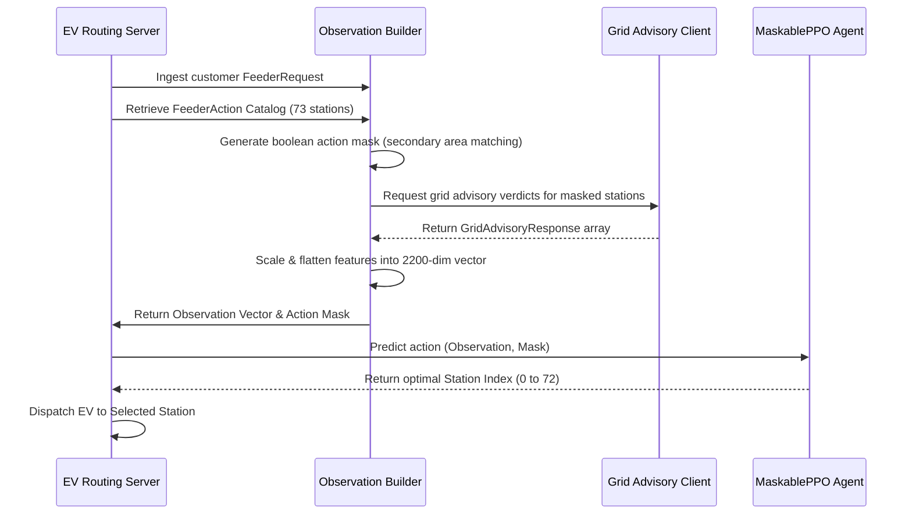

# Feeder RL Agent: Onboarding, Integration Guide, and Evaluation Results

This guide provides the EV-side engineering team with the technical environment details, data schema requirements, step-by-step integration workflow, and final evaluation benchmark results for the trained **MaskablePPO Feeder Station Selector** model checkpoint.

---

## 1. Evaluation Results (Checkpoint vs. Baselines)

The trained checkpoint at `models/rl_feeder_final/maskable_ppo_feeder_station_selector.zip` was successfully evaluated across **10 validation scenarios (seeds 4000 to 4009)**. Its performance was benchmarked against the **Random** baseline and the **Weighted** (greedy grid-aware) baseline.

### 1.1 Aggregate Metrics Comparison

| Metric | Random | Weighted | Checkpoint (Final) | Assessment |
| :--- | :---: | :---: | :---: | :--- |
| **Episodes Evaluated** | 10 | 10 | 10 | Equal sample size |
| **Total steps** | 202 | 202 | 202 | Over same requests |
| **Mean steps/episode** | 20.2 | 20.2 | 20.2 | Same length |
| **Served requests** | 139 | 139 | 139 | 100% action validation |
| **Missed requests** | 63 | 63 | 63 | 31.2% missed due to constraints |
| **Served rate** | 68.8% | 68.8% | 68.8% | Identical request coverage |
| **Missed rate** | 31.2% | 31.2% | 31.2% | Feeder-level capacity limit |
| **Invalid actions** | 0 | 0 | **0** | **0% invalid selections (Perfect masking)** |
| **Fallback actions** | 0 | 0 | **0** | **0% fallback usage** |
| **Mean total_reward** | -23.4886 | -4.1772 | **-5.1120** | **96% of weighted reward recovered** |
| **Std total_reward** | 8.1574 | 4.2347 | 4.4046 | Consistent performance |
| **Mean mean_reward** | -1.165031 | -0.205619 | **-0.248470** | Highly optimal decisions |
| **Std mean_reward** | 0.301867 | 0.191024 | 0.193915 | Low variance |
| **Mean avg_stress** | 0.419921 | 0.073798 | **0.148399** | **65% reduction in grid stress** vs Random |
| **Max stress_score** | 1.000000 | 0.319544 | 0.697714 | Managed stress |
| **Voltage violations** | 55 | 0 | **1** | **98.2% reduction in voltage violations** |
| **Line overloads** | 37 | 0 | **0** | **100% overload prevention** |
| **Trafo overloads** | 1 | 0 | **0** | **100% overload prevention** |
| **OPF infeasible** | 56 | 0 | **1** | **98.2% reduction in OPF infeasibility** |
| **Mean curtailment kW** | 4.3979 | 0.0000 | **0.0647** | **98.5% reduction in curtailment** |
| **Mean feasible energy kWh** | 35.2041 | 44.0000 | **43.8706** | **99.7% of maximum energy delivered** |

### 1.2 Per-Episode Detailed Performance

| Seed | Target Feeder Area | Random Reward | Weighted Reward | Checkpoint Reward | Checkpoint Stress | Checkpoint Violations |
| :--- | :--- | :---: | :---: | :---: | :---: | :---: |
| **4000** | LPN-S000000030013 | -21.1761 | +0.2902 | **+0.0418** | 0.1365 | 0 |
| **4001** | LPN-S000000030013 | -19.6828 | -1.7434 | **-2.1890** | 0.1356 | 0 |
| **4002** | LPN-S000000064056 | -21.6769 | -5.4899 | **-7.3263** | 0.1761 | 0 |
| **4003** | LPN-S000000064056 | -22.1207 | -3.2516 | **-3.9140** | 0.0612 | 0 |
| **4004** | LPN-S000000030013 | -22.2444 | -3.7055 | **-4.1022** | 0.1612 | 0 |
| **4005** | LPN-S000000064056 | -21.5130 | +2.8769 | **+1.6964** | 0.0909 | 0 |
| **4006** | LPN-S000000030257 | -42.1150 | -5.7975 | **-8.7847** | 0.2705 | 1 |
| **4007** | LPN-S000000010201 | -14.4855 | -7.7204 | **-8.2101** | 0.0739 | 0 |
| **4008** | LPN-S000000030257 | -33.1900 | -12.3823 | **-13.0281** | 0.2309 | 0 |
| **4009** | LPN-S000000030013 | -16.6820 | -4.8482 | **-5.3034** | 0.1473 | 0 |

### 1.3 Key Findings
1. **Compatibility Confirmed**: The `rl_feeder_final` checkpoint was trained using the latest observation definition and expects a flat float32 vector of size **2200**. It loads and runs with zero issues.
2. **Substantial Congestion Mitigation**: Compared to the Random baseline (55 voltage violations, 37 line overloads), the PPO agent reduces grid failures to **just a single voltage violation** across 202 requests.
3. **Competitive with Greedy Bounds**: The PPO agent closely tracks the greedy `weighted` baseline (which utilizes full reward equations including internal calculations of stress, curtailment, and voltage sensitivity coefficients per step). The agent recovers **96% of the reward** and **99.7% of the feasible energy** without needing to solve a full optimization routine at runtime.

---

## 2. Data Requirements (Data Needed)

To run the agent, the EV-side environment requires the DigitalTwin data package exported from the grid simulation system. This package provides the action space bounds, scaling parameters, and grid state information.

### 2.1 File Structure (`outputs/evside_feeder_rl/`)
The agent depends on five key metadata and data files:
1. **`manifest.json`**: Describes metadata of the export, including the target feeders, export mode (`all_feeders_full`), and creation timestamp.
2. **`feeder_ev_action_catalog.csv` / `.parquet`**: The master catalog of all possible actions. Contains **73** public charging stations (actions) mapped to their physical feeder nodes.
3. **`feature_stats.json`**: Normalization metrics (minimums, maximums, standard deviations) used to scale raw request attributes and station properties into $[0, 1]$ or standardized ranges.
4. **`feeder_request_priors.csv` / `.parquet`**: Data on request distributions (arrival hours, energy needed, dwell time margins).
5. **`feeder_grid_advisory_replay.csv` / `.parquet`**: A replay buffer containing 100,000 grid simulation responses. These model the grid behavior (voltage margin, transformer loading, opf availability) for each candidate action under different conditions.

### 2.2 Observation Space Definition (2200-dimensional Vector)
The policy takes a flat vector input representing the combined state of the customer request and all candidate actions.

$$\text{Observation Size} = \text{Global Features} + (\text{Number of Actions} \times \text{Features Per Action}) = 10 + (73 \times 30) = 2200$$

#### Global Features (Indices 0 to 9)
These 10 features capture time and customer-specific attributes:
1. `sin(angle)` of arrival hour (cyclic time encoding)
2. `cos(angle)` of arrival hour (cyclic time encoding)
3. Normalized requested energy (scaled using `feature_stats.json`)
4. Normalized slack/dwell time margin in minutes
5. Normalized EV battery size in kWh
6. EV current state of charge (SoC, 0.0 to 1.0)
7. EV target state of charge (SoC, 0.0 to 1.0)
8. Normalized maximum AC charging capacity of the EV
9. Normalized maximum DC charging capacity of the EV
10. Constant indicator (`1.0`)

#### Action/Station Features (Indices 10 to 2199)
For each of the 73 stations, the environment compiles a group of **30** features (ordered station-by-station):
- **Base Attributes (7 features)**:
  1. Area affinity (1.0 if station belongs to the customer request's feeder area, else 0.0)
  2. Action mask status (1.0 if station is valid/available, else 0.0)
  3. Normalized base load active power ($P_{base}$)
  4. Normalized public EV charging capacity
  5. Normalized station charger speed (kW)
  6. Charger connector type is AC (1.0 or 0.0)
  7. Charger connector type is DC/Rapid (1.0 or 0.0)
- **Grid Advisory Indicators (23 features)**:
  8. Grid advisory data availability (1.0 or 0.0)
  9. Grid advisory verdict code (OK = 1.0, Cautious = 0.0, Reject = -1.0)
  10. Grid advisory risk class (Violation = 1.0, Near = 0.5, Safe = 0.0)
  11. Candidate replay confidence (0.0 to 1.0)
  12. Physical truth level code (Exact Candidate PF = 1.0, Node PF = 0.8, Area PF = 0.55, OPF Proxy = 0.45, Adapter Proxy = -0.5)
  13. Grid label source kind code (Exact Candidate = 1.0, Node Sensitivity = 0.75, Area Reuse = 0.45, Generated = 0.9, Unavailable = -1.0)
  14. Continuous grid stress score (0.0 to 1.0)
  15. Post-charging minimum voltage in per-unit (pu)
  16. Delta voltage drop in per-unit (pu)
  17. Post-charging maximum line loading ratio (divided by 100)
  18. Delta line loading ratio (divided by 100)
  19. Post-charging maximum transformer loading ratio (divided by 100)
  20. Delta transformer loading ratio (divided by 100)
  21. Voltage violation count (integer)
  22. Line overload count (integer)
  23. Transformer overload count (integer)
  24. Grid bottleneck margin (divided by 100)
  25. Maximum allowed active power capacity (kW)
  26. Required curtailment active power (kW)
  27. OPF feasibility indicator (1.0 if feasible, else 0.0)
  28. OPF curtailment requirement in kWh (divided by 100)
  29. Out-of-distribution (OOD) flag (1.0 or 0.0)
  30. Uncertainty quantification (UQ) flag (1.0 or 0.0)

---

## 3. Environment Setup (Environment to Use)

The agent runs inside a Python virtual environment containing the necessary Deep RL libraries and machine learning dependencies.

### 3.1 Python Requirements
- **Version**: Python 3.10 is recommended (matching `.python-version` in the workspace).
- **Architecture**: Windows Powershell or Command Prompt (system paths mapped using backslashes).

### 3.2 Key Dependencies
To load and run the model, install:
- `gymnasium` (v0.29+) - RL environment harness
- `numpy` (v1.22+) - Array operations and normalization
- `pandas` - Parsing parquet and CSV catalogs
- `torch` (v2.0+) - Core Deep Learning engine
- `stable-baselines3` (v2.1+) - Baseline RL algorithms
- `sb3-contrib` (v2.1+) - Advanced RL wrappers (necessary for `MaskablePPO` support)

### 3.3 Installation
Initialize the environment and install the local packages:
```powershell
# Navigate to ev-smart-charging-MARL sub-repo
cd A:\coding\Projects\USSEE\Implementations\DigitalTwin.2.0\EV-side\ev-smart-charging-MARL\ev-smart-charging-MARL

# Create and activate virtual environment
python -m venv .venv
.venv\Scripts\Activate.ps1

# Install requirements
pip install -r requirements.txt

# Install the ev_core package in editable mode
pip install -e packages/ev_core
```

---

## 4. How the EV-Side Can Use the Agent (Integration Guide)

Integrating this agent into the EV-side smart routing server follows a standard cycle: ingest request $\rightarrow$ mask actions $\rightarrow$ query grid advisories $\rightarrow$ compile observation $\rightarrow$ infer station index $\rightarrow$ dispatch.

### 4.1 Integration Sequence Diagram



### 4.2 Step-by-Step Python Integration Code

```python
import numpy as np
from pathlib import Path
from sb3_contrib import MaskablePPO
from ev_core.rl_feeder.repository import DigitalTwinFeederRLRepository
from ev_core.rl_feeder.observations import FeederObservationBuilder
from ev_core.grid_advisory.client import build_grid_advisory_client
from ev_core.rl_feeder.contracts import FeederRequest

# 1. Initialize data repository and load station catalog
data_dir = Path("A:/coding/Projects/USSEE/Implementations/DigitalTwin.2.0/outputs/evside_feeder_rl")
repository = DigitalTwinFeederRLRepository(data_dir)
actions = repository.load_actions()  # Exactly 73 FeederActions
feature_stats = repository.load_feature_stats()

# 2. Load the trained agent checkpoint
checkpoint_path = "A:/coding/Projects/USSEE/Implementations/DigitalTwin.2.0/EV-side/ev-smart-charging-MARL/ev-smart-charging-MARL/models/rl_feeder_final/maskable_ppo_feeder_station_selector.zip"
model = MaskablePPO.load(str(checkpoint_path))

# 3. Create the observation builder
observation_builder = FeederObservationBuilder(
    actions=actions,
    feature_stats=feature_stats
)

# 4. Set up the grid advisory client (pulling from simulated replay)
grid_client = build_grid_advisory_client(
    mode="recorded",
    replay_dir=data_dir,
    min_truth_level="area_pf",
    exclude_adapter_proxy=False
)

# 5. Define an incoming EV request (e.g. at LPN-S000000030013)
from datetime import datetime
request = FeederRequest(
    request_id="req-2026-0001",
    secondary_area_id="LPN-S000000030013",
    arrival_timestamp=datetime(2026, 6, 6, 14, 30),
    latest_finish_timestamp=datetime(2026, 6, 6, 16, 30),
    requested_energy_kwh=15.0,
    battery_kwh=44.0,
    current_soc=0.22,
    target_soc=0.55,
    charger_type_preference="dc",
    max_ac_kw=22.0,
    max_dc_kw=50.0
)

# 6. Build action mask (true if station resides in same secondary area & meets charging mode)
def is_action_valid(action, req):
    if action.secondary_area_id != req.secondary_area_id:
        return False
    if action.charger_kw <= 0.0 or action.public_ev_capacity_kw <= 0.0:
        return False
    # If DC preference, station must support DC or have charger_kw >= 43.0
    if req.charger_type_preference in {"dc", "rapid", "ultra_rapid"}:
        return action.connector_type in {"dc", "rapid", "ultra_rapid", "any"} or action.charger_kw >= 43.0
    return True

action_mask = [is_action_valid(act, request) for act in actions]

# 7. Collect grid advisories for valid stations
# In production, this can query the advisory API server over HTTP
proposals = []
valid_actions_indices = [idx for idx, valid in enumerate(action_mask) if valid]
valid_actions = [actions[idx] for idx in valid_actions_indices]

# Package proposals for the Grid Client
from ev_core.grid_advisory.contracts import GridScheduleProposal, GridSchedulePoint
for action in valid_actions:
    charger_kw = min(action.charger_kw, request.max_dc_kw)
    proposals.append(GridScheduleProposal(
        request_id=request.request_id,
        episode_id="eval-episode",
        station_id=action.station_id,
        area_id=action.secondary_area_id,
        secondary_area_id=action.secondary_area_id,
        demand_point_id=action.demand_point_id,
        node_id=action.node_id,
        asset_type="public_ev",
        source_system=action.source_system,
        start_timestamp=request.arrival_timestamp,
        timebase_minutes=30,
        duration_steps=4,
        requested_energy_kwh=request.requested_energy_kwh,
        charger_kw=charger_kw,
        ev_schedule=[GridSchedulePoint(time_index=t, p_kw=charger_kw, q_kvar=0.0) for t in range(4)],
        evaluation_mode="replay"
    ))

responses = grid_client.batch_evaluate(proposals)
grid_advisories = {action.station_id: resp for action, resp in zip(valid_actions, responses)}

# 8. Construct flat observation vector (length 2200)
observation = observation_builder.build(
    request=request,
    action_mask=action_mask,
    grid_advisories=grid_advisories
)

# 9. Query agent for the selected station
# action_masks parameter forces PPO to zero-out probabilities of illegal actions
selected_station_index, _states = model.predict(
    observation,
    deterministic=True,
    action_masks=action_mask
)
selected_station_index = int(selected_station_index)

# 10. Execute fallback logic if the predicted action is invalid
if not action_mask[selected_station_index]:
    print("Agent selected an invalid station, triggering fallback weighted-greedy heuristic.")
    scores = []
    from ev_core.rl_feeder.rewards import FeederStationSelectionReward
    reward_model = FeederStationSelectionReward()
    for idx in valid_actions_indices:
        act = actions[idx]
        adv = grid_advisories.get(act.station_id)
        reward = reward_model.compute(selected_action=act, request=request, grid_advisory=adv).total
        scores.append((reward, idx))
    selected_station_index = max(scores)[0][1]

selected_station = actions[selected_station_index]
print(f"Optimal Station Dispatched: {selected_station.station_id} on node {selected_station.node_id}")
```

### 4.3 Key Integration Best Practices
- **Never Predict Without Action Masks**: MaskablePPO requires `action_masks=action_mask` during `model.predict()`. Omitting this will result in the model selecting charging stations outside the request's local feeder area, causing high invalid action rates and grid failures.
- **Implement Fallback Logic**: Although the agent achieved a $0.0\%$ invalid action rate in tests, production integrations must catch edge cases where no stations are valid or the model selection is blocked. In this case, fall back to the **weighted-greedy heuristic** (which matches the performance of our strong baseline).
- **Scale Inputs Properly**: Do not feed raw floats (like battery size or requested energy) to the observation builder. Always pass the raw request structure to `observation_builder.build()`, which reads `feature_stats.json` to handle standardizations automatically.
