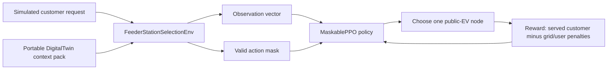
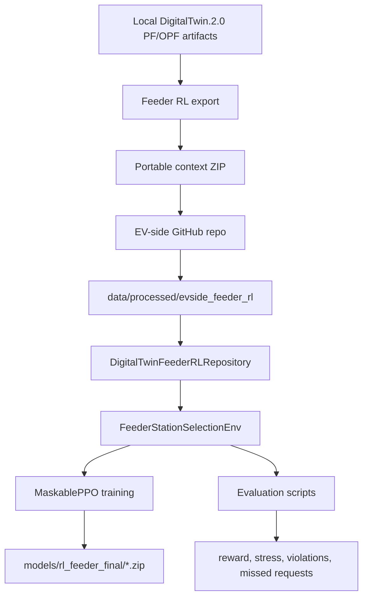
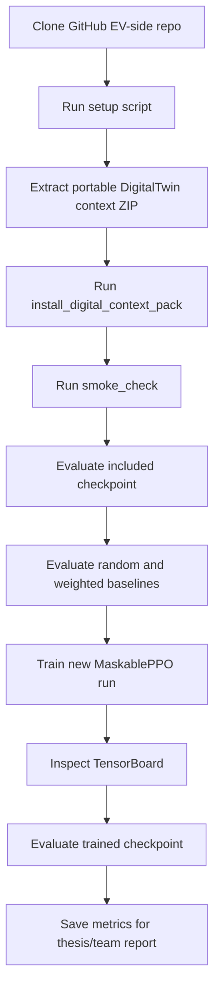

# EV-side RL Full Project Runbook With Portable DigitalTwin Context

This runbook explains how to use the full EV-side project for feeder-aligned reinforcement learning when the EV team does not have the local `DigitalTwin.2.0` repository.

The short version:

1. The GitHub EV-side repo contains the code.
2. The portable ZIP contains the DigitalTwin-derived context needed by the RL code.
3. The EV team installs the ZIP into `data/processed/evside_feeder_rl`.
4. The EV team can smoke test, evaluate, train, and inspect TensorBoard locally.
5. The EV team cannot generate new PF/OPF grid labels until the DigitalTwin service or export pipeline is shared.

## Current Portable ZIP

The portable context ZIP created from the local DigitalTwin project is:

```text
A:/coding/Projects/USSEE/Implementations/DigitalTwin.2.0/outputs/evside_portable_context_exports/evside_digital_context_xl_20260613T185936Z.zip
```

The extracted folder name is:

```text
evside_digital_context_xl_20260613T185936Z
```

Inside the ZIP, the important files are:

```text
evside_feeder_rl/
  feeder_ev_action_catalog.parquet
  feeder_request_priors.parquet
  feeder_grid_advisory_replay.parquet
  feeder_episode_catalog.parquet
  feature_stats.json
  model_card.json
  quality_report.json
  candidate_replay_quality_report.json
  ev2gym_config/

models/
  rl_feeder_final/
    maskable_ppo_feeder_station_selector.zip

checksums_sha256.json
portable_context_manifest.json
README.md
```

The ZIP was generated by:

```text
A:/coding/Projects/USSEE/Implementations/DigitalTwin.2.0/scripts/export_evside_portable_digital_context.py
```

## What This Package Represents

The ZIP is not raw DigitalTwin data. It is a compact, EV-side-ready context pack.

It contains enough DigitalTwin-derived information for the EV-side RL environment to behave as if it has grid context during offline training and evaluation.

Current scale:

```text
public EV source records: 919
exact node-mapped RL actions: 73
low-voltage feeder areas: 10
request prior rows: 30
candidate replay rows: 100,000
candidate generation queue rows: 922
included checkpoint: yes
```

Current grid truth mix:

```text
label_source_kind: area_reuse = 100,000 rows
physical_truth_level: area_pf = 100,000 rows
adapter/proxy rows: 0
mean candidate replay confidence: 0.58
```

This means the current replay is useful for EV-side RL development and training, but it is not yet the strongest possible grid replay. The strongest future version would include many `exact_candidate_pf` or `node_pf` rows instead of only `area_pf`.

## Mental Model

The EV-side RL agent is a station-selection agent.

It receives one simulated customer charging request and chooses one DigitalTwin public-EV station/node.

It is not predicting voltage directly. It is learning a policy:

```text
Given this request and these candidate stations, choose the station that gives acceptable customer service with lower grid stress.
```



## Project Components

The full EV-side repo is more than the RL script. These are the parts that matter:

```text
apps/api/
  FastAPI app and recommendation API boundary.

apps/mobile/
  Expo React Native mobile client.

dashboards/sim_dashboard/
  Streamlit dashboard.

packages/ev_core/
  Core simulator, data contracts, recommender policies, grid advisory clients,
  RL environments, rewards, observations, and feeder RL repository.

services/sim_runtime/
  Runtime manager and event/state orchestration.

scripts/rl_training/
  Training and evaluation entrypoints for MaskablePPO.

scripts/install_digital_context_pack.*
  Helpers that install the portable ZIP contents into the GitHub-clean repo.
```

The feeder RL code path lives mainly in:

```text
packages/ev_core/src/ev_core/rl_feeder/env.py
packages/ev_core/src/ev_core/rl_feeder/observations.py
packages/ev_core/src/ev_core/rl_feeder/rewards.py
packages/ev_core/src/ev_core/rl_feeder/repository.py
packages/ev_core/src/ev_core/grid_advisory/
scripts/rl_training/train_maskable_ppo_feeder_station_selector.py
scripts/rl_training/evaluate_maskable_ppo_feeder_station_selector.py
```

## Full Data Flow



## Install From A Clean GitHub Clone

Start from a clean clone of the EV-side GitHub repo.

Expected repo root:

```text
ev-smart-charging-MARL/
  README.md
  apps/
  packages/
  scripts/
  data/
  models/
  outputs/
```

### Step 1: Create The Python Environment

Windows:

```bat
scripts\setup.bat
.venv\Scripts\activate.bat
```

PowerShell alternative:

```powershell
scripts\setup.bat
.\.venv\Scripts\Activate.ps1
```

macOS / Linux:

```bash
bash scripts/setup.sh
source .venv/bin/activate
```

Expected result:

```text
requirements installed
packages/ev_core installed editable
python can import ev_core
```

If Parquet loading fails with `pyarrow` missing, install the requirements inside the active venv:

```bash
python -m pip install -r requirements.txt
```

The RL package needs Parquet support because the portable context uses `.parquet` files.

### Step 2: Extract The Portable ZIP

Extract:

```text
evside_digital_context_xl_20260613T185936Z.zip
```

After extraction, you should have:

```text
evside_digital_context_xl_20260613T185936Z/
  evside_feeder_rl/
  models/
  README.md
  portable_context_manifest.json
  checksums_sha256.json
```

### Step 3: Install The Context Pack

Windows:

```bat
scripts\install_digital_context_pack.bat C:\path\to\evside_digital_context_xl_20260613T185936Z
set FEEDER_RL_DATA_DIR=data\processed\evside_feeder_rl
```

PowerShell:

```powershell
scripts\install_digital_context_pack.bat C:\path\to\evside_digital_context_xl_20260613T185936Z
$env:FEEDER_RL_DATA_DIR = "data\processed\evside_feeder_rl"
```

macOS / Linux:

```bash
bash scripts/install_digital_context_pack.sh /path/to/evside_digital_context_xl_20260613T185936Z
export FEEDER_RL_DATA_DIR=data/processed/evside_feeder_rl
```

After installation, the EV repo should contain:

```text
data/processed/evside_feeder_rl/
  feeder_ev_action_catalog.parquet
  feeder_request_priors.parquet
  feeder_grid_advisory_replay.parquet
  ...

models/rl_feeder_final/
  maskable_ppo_feeder_station_selector.zip
```

## Check The Installed Context

Run this from the EV-side repo root.

PowerShell:

```powershell
Get-ChildItem data\processed\evside_feeder_rl
Get-Content data\processed\evside_feeder_rl\candidate_replay_quality_report.json
Get-Content data\processed\evside_feeder_rl\model_card.json
```

Bash:

```bash
ls data/processed/evside_feeder_rl
cat data/processed/evside_feeder_rl/candidate_replay_quality_report.json
cat data/processed/evside_feeder_rl/model_card.json
```

Expected key values:

```text
candidate_replay_row_count: 100000
label_source_kind_counts.area_reuse: 100000
physical_truth_level_counts.area_pf: 100000
adapter_proxy_row_count: 0
```

## Smoke Check

Smoke check verifies imports, selected tests, and a dry-run environment setup.

Windows:

```bat
set FEEDER_RL_DATA_DIR=data\processed\evside_feeder_rl
scripts\smoke_check.bat
```

PowerShell:

```powershell
$env:FEEDER_RL_DATA_DIR = "data\processed\evside_feeder_rl"
scripts\smoke_check.bat
```

macOS / Linux:

```bash
export FEEDER_RL_DATA_DIR=data/processed/evside_feeder_rl
bash scripts/smoke_check.sh
```

Expected output includes:

```text
MaskablePPO feeder public-EV station selector setup
public_ev_action_count: 73
request_prior_rows: 30
grid_metric_columns: ...
dry_run: no training performed
```

If the smoke check skips the feeder RL dry-run, then `FEEDER_RL_DATA_DIR` is not pointing at the installed context folder.

## What The Agent Observes

The observation is a flat vector created by:

```text
packages/ev_core/src/ev_core/rl_feeder/observations.py
```

It contains:

```text
global request features:
  arrival time encoded as sin/cos
  requested energy
  slack time
  battery capacity
  current SOC
  target SOC
  AC/DC charger limits
  bias flag

per-action features for every public-EV node:
  same feeder flag
  valid action mask flag
  base power
  station capacity
  charger power
  AC/DC connector flags
  advisory available flag
  verdict code
  risk code
  replay confidence
  physical truth code
  label source code
  stress score
  voltage metrics
  line and transformer loading metrics
  violation counts
  bottleneck margin
  max allowed kW
  curtailment
  OPF feasible flag
  OOD/UQ flags
```

The current vector size is:

```text
10 global features + 73 actions * 30 action features = 2200 features
```

The environment prints the actual shape during `--dry-run`.

## What The Action Means

The action space is discrete:

```text
action 0 = choose public-EV node 0 from feeder_ev_action_catalog
action 1 = choose public-EV node 1 from feeder_ev_action_catalog
...
```

The agent does not invent stations. It can only choose from the DigitalTwin public-EV action catalog.

Current action catalog:

```text
source: DigitalTwin public-EV assets
valid mapped actions: 73
feeders: 10
truth_status: feeder_aligned
```

Dundee and ACN do not define the station action space. They only help simulate charging request behavior.

## What The Action Mask Does

The mask prevents impossible actions.

An action is valid only when:

```text
station.secondary_area_id == request.secondary_area_id
station has positive charger power
station has positive capacity
station connector can serve the request preference
```

MaskablePPO uses this mask so the policy does not waste time selecting invalid cross-feeder stations.

This is why we use `sb3-contrib` MaskablePPO instead of regular PPO.

## What The Reward Means

The reward is defined in:

```text
packages/ev_core/src/ev_core/rl_feeder/rewards.py
```

The reward starts with a service reward:

```text
served_reward = +1.0
```

Then penalties are applied:

```text
invalid_action_penalty
missed_request_penalty
capacity_penalty
distance_penalty
stress_penalty
voltage_delta_penalty
loading_delta_penalty
violation_penalty
opf_penalty
curtailment_penalty
uncertainty_penalty
```

The agent is therefore learning:

```text
serve the customer, but avoid stations that create high stress, voltage problems,
line/transformer overloads, OPF infeasibility, or uncertain low-confidence grid labels.
```

## Training

Use the helper script for normal training.

Windows:

```bat
set FEEDER_RL_DATA_DIR=data\processed\evside_feeder_rl
set TOTAL_TIMESTEPS=2000000
set SCENARIO_COUNT=512
set DURATION_HOURS=24
set CHECKPOINT_FREQ=50000
scripts\train_feeder_rl.bat
```

PowerShell:

```powershell
$env:FEEDER_RL_DATA_DIR = "data\processed\evside_feeder_rl"
$env:TOTAL_TIMESTEPS = "2000000"
$env:SCENARIO_COUNT = "512"
$env:DURATION_HOURS = "24"
$env:CHECKPOINT_FREQ = "50000"
scripts\train_feeder_rl.bat
```

macOS / Linux:

```bash
export FEEDER_RL_DATA_DIR=data/processed/evside_feeder_rl
export TOTAL_TIMESTEPS=2000000
export SCENARIO_COUNT=512
export DURATION_HOURS=24
export CHECKPOINT_FREQ=50000
bash scripts/train_feeder_rl.sh
```

The helper calls:

```text
scripts/rl_training/train_maskable_ppo_feeder_station_selector.py
```

With these important defaults:

```text
--grid-advisory-mode recorded
--grid-evaluation-mode replay
--request-prior-sources dundee,acn,digitaltwin
--min-truth-level area_pf
--exclude-adapter-proxy
--require-replay-covered-area
--checkpoint-freq 50000
```

### Training Output

Main checkpoint:

```text
models/rl_feeder_final/maskable_ppo_feeder_station_selector.zip
```

Periodic checkpoints:

```text
models/rl_feeder_final/checkpoints/
```

TensorBoard logs:

```text
outputs/rl_feeder/tensorboard_final/
```

### Graceful Time-Limited Training

If the machine has a limited runtime window, use the Python entrypoint directly:

```powershell
python scripts\rl_training\train_maskable_ppo_feeder_station_selector.py `
  --feeder-rl-data-dir data\processed\evside_feeder_rl `
  --output-dir models\rl_feeder_final `
  --tensorboard-log outputs\rl_feeder\tensorboard_final `
  --grid-advisory-mode recorded `
  --grid-evaluation-mode replay `
  --request-prior-sources dundee,acn,digitaltwin `
  --min-truth-level area_pf `
  --exclude-adapter-proxy `
  --require-replay-covered-area `
  --scenario-count 512 `
  --duration-hours 24 `
  --total-timesteps 2000000 `
  --checkpoint-freq 50000 `
  --max-wall-clock-minutes 360
```

This writes a graceful stop checkpoint if the wall-clock limit is reached:

```text
models/rl_feeder_final/maskable_ppo_feeder_station_selector_wall_clock_stop.zip
```

## Resume Training

Resume from a periodic checkpoint:

```powershell
python scripts\rl_training\train_maskable_ppo_feeder_station_selector.py `
  --feeder-rl-data-dir data\processed\evside_feeder_rl `
  --output-dir models\rl_feeder_final `
  --tensorboard-log outputs\rl_feeder\tensorboard_final `
  --grid-advisory-mode recorded `
  --grid-evaluation-mode replay `
  --request-prior-sources dundee,acn,digitaltwin `
  --min-truth-level area_pf `
  --exclude-adapter-proxy `
  --require-replay-covered-area `
  --scenario-count 512 `
  --duration-hours 24 `
  --total-timesteps 800000 `
  --checkpoint-freq 50000 `
  --resume-from models\rl_feeder_final\checkpoints\maskable_ppo_feeder_station_selector_<STEP>_steps.zip
```

Important:

```text
--total-timesteps means additional timesteps for the resumed call.
```

## TensorBoard

Start TensorBoard:

Windows:

```bat
scripts\tensorboard_rl.bat
```

macOS / Linux:

```bash
bash scripts/tensorboard_rl.sh
```

Open:

```text
http://localhost:6007
```

Useful TensorBoard signals:

```text
rollout/ep_rew_mean
rollout/ep_len_mean
train/explained_variance
train/entropy_loss
train/approx_kl
train/value_loss
time/fps
time/total_timesteps
```

How to read them:

```text
ep_rew_mean should improve over time or become less negative.
entropy_loss becoming less negative usually means the policy is becoming more confident.
explained_variance closer to 1.0 means the value function is predicting returns better.
approx_kl should not explode; high KL can mean unstable updates.
```

## Evaluation

Evaluate the included or trained checkpoint:

Windows:

```bat
set FEEDER_RL_DATA_DIR=data\processed\evside_feeder_rl
scripts\evaluate_feeder_rl.bat
```

PowerShell:

```powershell
$env:FEEDER_RL_DATA_DIR = "data\processed\evside_feeder_rl"
scripts\evaluate_feeder_rl.bat
```

macOS / Linux:

```bash
export FEEDER_RL_DATA_DIR=data/processed/evside_feeder_rl
bash scripts/evaluate_feeder_rl.sh
```

Evaluate random baseline:

```powershell
python scripts\rl_training\evaluate_maskable_ppo_feeder_station_selector.py `
  --feeder-rl-data-dir data\processed\evside_feeder_rl `
  --policy random `
  --grid-advisory-mode recorded `
  --grid-evaluation-mode replay `
  --min-truth-level area_pf `
  --exclude-adapter-proxy `
  --require-replay-covered-area
```

Evaluate weighted baseline:

```powershell
python scripts\rl_training\evaluate_maskable_ppo_feeder_station_selector.py `
  --feeder-rl-data-dir data\processed\evside_feeder_rl `
  --policy weighted `
  --grid-advisory-mode recorded `
  --grid-evaluation-mode replay `
  --min-truth-level area_pf `
  --exclude-adapter-proxy `
  --require-replay-covered-area
```

Evaluate checkpoint:

```powershell
python scripts\rl_training\evaluate_maskable_ppo_feeder_station_selector.py `
  --feeder-rl-data-dir data\processed\evside_feeder_rl `
  --checkpoint-path models\rl_feeder_final\maskable_ppo_feeder_station_selector.zip `
  --policy checkpoint `
  --grid-advisory-mode recorded `
  --grid-evaluation-mode replay `
  --min-truth-level area_pf `
  --exclude-adapter-proxy `
  --require-replay-covered-area
```

Important metrics:

```text
total_reward
mean_reward
missed_requests
invalid_actions
fallback_actions
average_stress_score
max_stress_score
voltage_violation_count
line_overload_count
trafo_overload_count
opf_infeasible_count
mean_curtailment_required_kw
mean_feasible_energy_kwh
truth_level_counts
```

Good signs:

```text
invalid_actions = 0
fallback_actions = 0 for checkpoint policy
checkpoint mean_reward > random mean_reward
checkpoint mean_reward >= weighted mean_reward
average stress score lower than random baseline
violation counts lower than random baseline
```

Do not describe this as classification accuracy. For RL, use:

```text
reward improvement
grid stress reduction
violation reduction
customer service tradeoff
policy stability
```

## Running The Rest Of The EV Project

The RL workflow is part of a broader EV app.

### API

Run the API:

```bash
uvicorn apps.api.main:app --reload --port 8000
```

Typical local URL:

```text
http://127.0.0.1:8000
```

### Dashboard

Run the Streamlit dashboard:

```bash
streamlit run dashboards/sim_dashboard/app.py
```

### Mobile App

From:

```text
apps/mobile/
```

Install and run with the normal Expo workflow:

```bash
npm install
npx expo start
```

The mobile app and API currently use the broader recommendation/runtime stack. The feeder RL checkpoint path exists in the code, but full production runtime integration still depends on building feeder observations and candidate masks for live requests.

## Runtime Feeder RL Policy

The feeder checkpoint-backed policy is:

```text
rl_maskable_ppo_feeder
```

Code:

```text
packages/ev_core/src/ev_core/recommender/feeder_rl_policy.py
```

Environment variable:

```text
RL_FEEDER_CHECKPOINT_PATH=models/rl_feeder_final/maskable_ppo_feeder_station_selector.zip
```

Runtime fallback:

```text
If checkpoint is missing, dependencies are missing, or feeder tensors are missing,
the policy falls back to weighted_score.
```

PR 4 strict verification:

```powershell
uv run --with pyarrow --with pydantic --with numpy --with torch --with stable-baselines3 --with sb3-contrib python scripts\verification\verify_feeder_rl_api_no_fallback.py --strict
```

This command exercises the app/runtime recommendation path with the installed offline feeder package and final checkpoint. In strict mode it requires `fallback_used=false`. The selected action is still a DigitalTwin feeder public-EV action/node using recorded `area_pf` replay, not live DigitalTwin closed-loop PF/OPF, forecasting, or MARL.

For full live use, the runtime request path must provide:

```text
feeder_observation
feeder_action_mask
feeder_station_ids
candidate recommendations
grid advisory metadata
```

Training/evaluation already build these tensors inside `FeederStationSelectionEnv`. The live API path still needs the final adapter that builds the same tensor for real requests.

## EV2Gym Role

The portable context includes:

```text
data/processed/evside_feeder_rl/ev2gym_config/
```

EV2Gym is useful for:

```text
benchmark curves
charging-session simulation
baseline comparison
second-stage charging control experiments
```

EV2Gym is not the grid truth source for voltage/loading. DigitalTwin PF/OPF replay remains the grid truth source.

## Common Problems

### `pyarrow` Missing

Symptom:

```text
ImportError: Unable to find a usable engine; tried using: 'pyarrow', 'fastparquet'
```

Fix:

```bash
python -m pip install -r requirements.txt
```

or:

```bash
python -m pip install pyarrow
```

### `torch` Missing Even Though It Exists Globally

This means the active venv does not have Torch.

Check:

```bash
where python
python -c "import sys; print(sys.executable)"
python -c "import torch; print(torch.__version__, torch.cuda.is_available())"
```

Install Torch inside the active venv. Do not rely on user-site Python packages outside the venv.

### Smoke Check Skips Feeder RL

Set:

```bash
FEEDER_RL_DATA_DIR=data/processed/evside_feeder_rl
```

Then rerun smoke check.

### Checkpoint Evaluation Fails

Confirm:

```text
models/rl_feeder_final/maskable_ppo_feeder_station_selector.zip
```

exists. If it does not, install the context pack again or train a checkpoint.

### TensorBoard Shows Nothing

Confirm the log directory:

```text
outputs/rl_feeder/tensorboard_final/
```

Then run:

```bash
tensorboard --logdir outputs/rl_feeder/tensorboard_final --port 6007
```

## What Is Missing

This section is important for honest engineering and thesis language.

### Missing 1: Full DigitalTwin Runtime Backend For The EV Team

The EV team can use offline replay from the ZIP. They cannot call live PF/OPF because the full DigitalTwin project is not shared or hosted yet.

Needed later:

```text
hosted DigitalTwin advisory API
authentication
versioned model cards
batch candidate evaluate endpoint
runtime monitoring
```

### Missing 2: Exact Candidate PF/OPF Replay At Large Scale

Current ZIP:

```text
100,000 area_pf replay rows
0 exact_candidate_pf rows
0 node_pf rows
```

This is useful, but the next stronger version should use:

```text
exact_candidate_pf where possible
node_pf sensitivity rows
area_pf only as fallback
```

### Missing 3: Mapping Repair From 73 Actions Toward 919 Public-EV Records

Current action space:

```text
73 exact node-mapped actions
919 source public-EV records
846 records not yet usable as RL actions
```

To expand the final model, we need more defensible public-EV-to-node mappings.

### Missing 4: Live API Tensor Adapter

Training and evaluation build observations inside the Gymnasium environment.

The live recommendation API still needs a production-grade adapter that converts an incoming customer request into:

```text
same action catalog
same candidate mask
same grid advisory features
same observation tensor
```

Only then can the API reliably use `rl_maskable_ppo_feeder` for live recommendations.

### Missing 5: Full MARL

Current system:

```text
single-agent station selection
```

Future MARL:

```text
FeederCoordinatorAgent
StationSelectionAgent
ChargingControlAgent
PricingAgent
QueueOperationsAgent
GridSafetyAgent
```

MARL should start after the single-agent agent beats random and weighted baselines on replay-backed evaluation.

### Missing 6: Final Thesis-Grade Benchmark Set

The current package supports development and offline training.

For final thesis claims, we still need:

```text
fixed train/validation/test split
random baseline
weighted baseline
checkpoint policy
stress and violation metrics
statistical comparison across many seeds
clear claim boundary for area_pf replay
```

## Recommended EV Team Workflow



## Recommended Commands In Order

Windows PowerShell:

```powershell
scripts\setup.bat
.\.venv\Scripts\Activate.ps1
scripts\install_digital_context_pack.bat C:\path\to\evside_digital_context_xl_20260613T185936Z
$env:FEEDER_RL_DATA_DIR = "data\processed\evside_feeder_rl"
scripts\smoke_check.bat
scripts\evaluate_feeder_rl.bat
scripts\tensorboard_rl.bat
```

In another terminal:

```powershell
.\.venv\Scripts\Activate.ps1
$env:FEEDER_RL_DATA_DIR = "data\processed\evside_feeder_rl"
$env:TOTAL_TIMESTEPS = "2000000"
$env:SCENARIO_COUNT = "512"
$env:DURATION_HOURS = "24"
$env:CHECKPOINT_FREQ = "50000"
scripts\train_feeder_rl.bat
```

macOS / Linux:

```bash
bash scripts/setup.sh
source .venv/bin/activate
bash scripts/install_digital_context_pack.sh /path/to/evside_digital_context_xl_20260613T185936Z
export FEEDER_RL_DATA_DIR=data/processed/evside_feeder_rl
bash scripts/smoke_check.sh
bash scripts/evaluate_feeder_rl.sh
bash scripts/tensorboard_rl.sh
```

In another terminal:

```bash
source .venv/bin/activate
export FEEDER_RL_DATA_DIR=data/processed/evside_feeder_rl
export TOTAL_TIMESTEPS=2000000
export SCENARIO_COUNT=512
export DURATION_HOURS=24
export CHECKPOINT_FREQ=50000
bash scripts/train_feeder_rl.sh
```

## What The EV Team Can Claim Today

Safe claim:

```text
The EV-side project can train and evaluate a MaskablePPO station-selection
agent over DigitalTwin-derived low-voltage public-EV feeder nodes using a
portable recorded grid-advisory replay package.
```

More precise claim:

```text
The current portable package contains 73 exact node-mapped public-EV actions
across 10 feeders and 100,000 area-level PF replay rows. It supports offline
development and benchmarking while the full DigitalTwin service remains local.
```

Avoid claiming:

```text
The EV-side repo contains the full DigitalTwin.
The EV-side team can generate new PF/OPF labels from the ZIP alone.
The current checkpoint is final thesis-grade proof.
The current replay is exact candidate-level PF/OPF for every action.
```

## Owner Notes

When DigitalTwin becomes hosted, the portable replay workflow should remain useful as:

```text
offline training cache
regression test fixture
fallback mode when the advisory API is unavailable
benchmark dataset for comparing policies
```

The live system should then add:

```text
GRID_ADVISORY_MODE=http
DigitalTwin /v1/proposals/batch-evaluate
fresh candidate grid metrics
runtime hard gates for severe violations
telemetry for selected station, stress score, bottleneck, and fallback status
```
